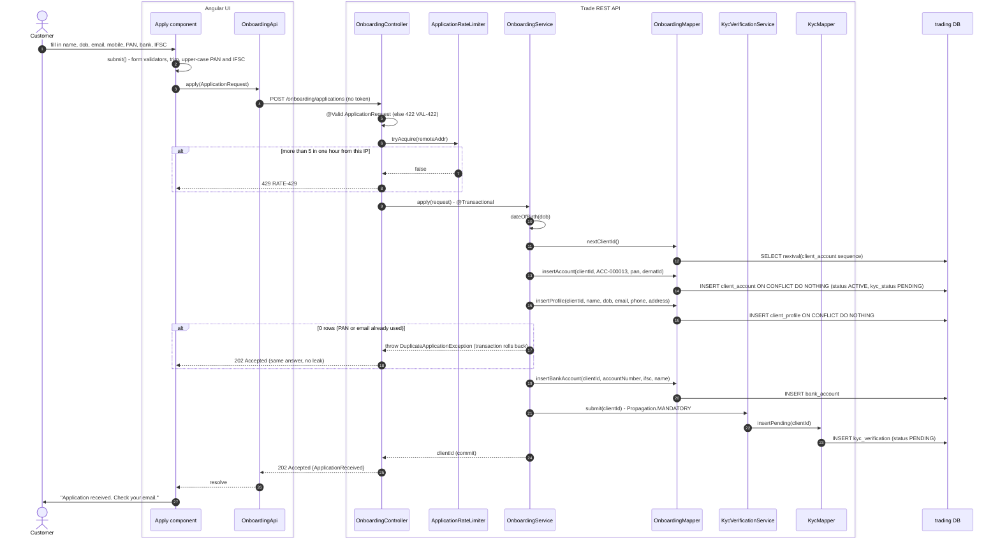
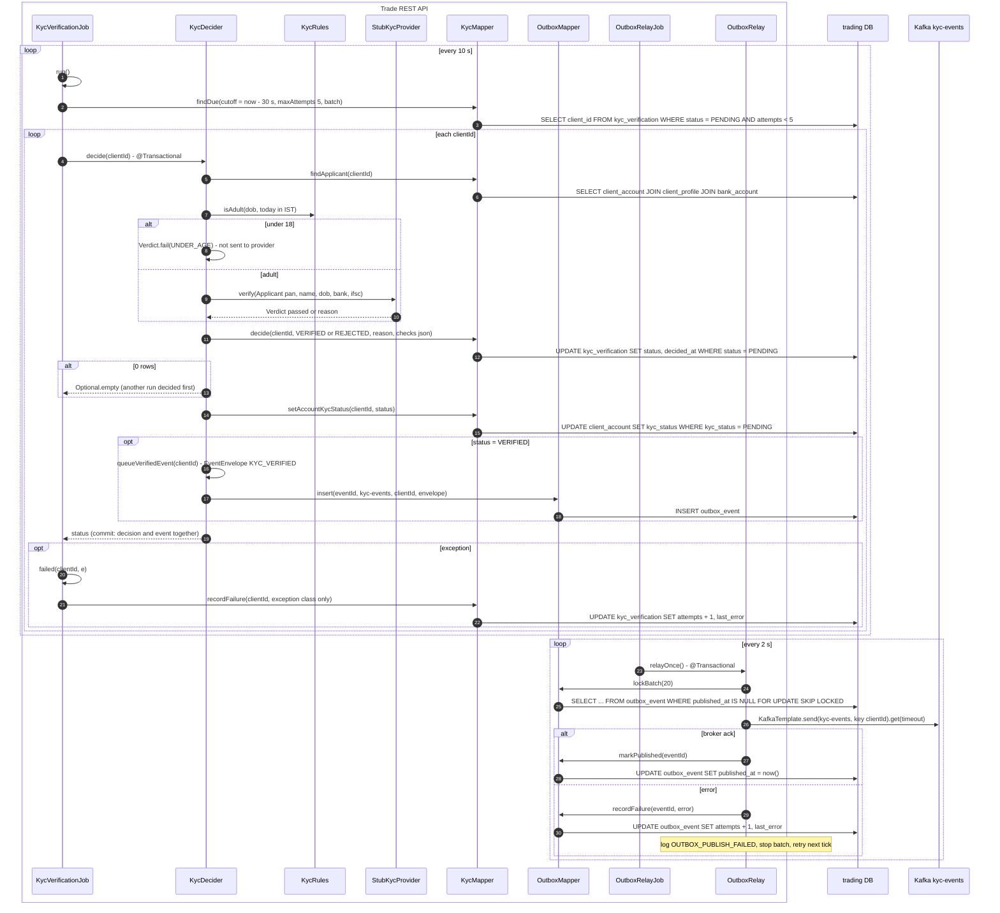
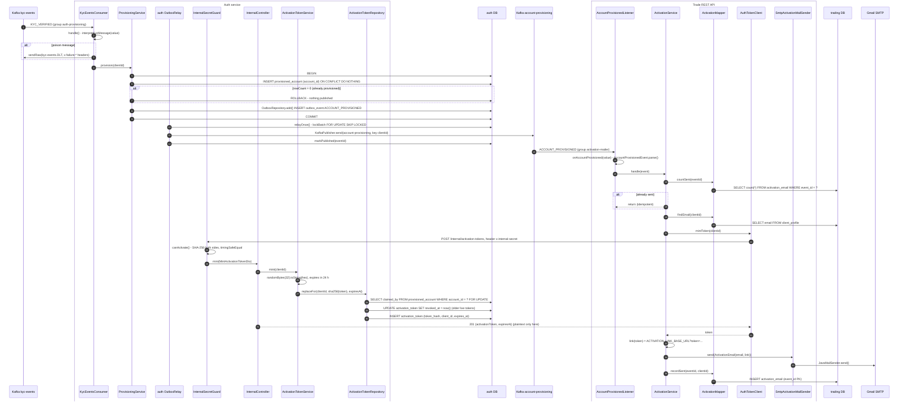
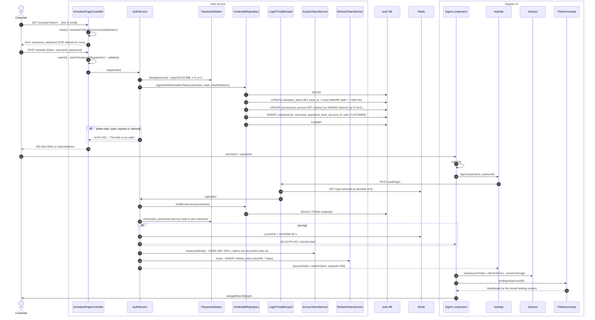

# Flow 1: Create an account

From the application form to the first sign-in. The flow has four parts: (A) the customer gives the information, (B) the KYC check, (C) account provisioning and the activation email, (D) activation and first sign-in.

Each arrow names the function that runs. Each database arrow names the mapper method and the table.

## A. The customer gives the information

## B. The KYC check

The check runs on a timer, not in the request. It waits `KYC_DELAY` (30 s) after the application.

## C. Account provisioning and the activation email

## D. Activation and first sign-in

## Tables written in this flow

| Table | Database | Written by | Step |
|---|---|---|---|
| `client_account` | trading | `OnboardingMapper.insertAccount`, `KycMapper.setAccountKycStatus` | A, B |
| `client_profile` | trading | `OnboardingMapper.insertProfile` | A |
| `bank_account` | trading | `OnboardingMapper.insertBankAccount` | A |
| `kyc_verification` | trading | `KycMapper.insertPending`, `decide`, `recordFailure` | A, B |
| `outbox_event` | trading | `OutboxMapper.insert`, `markPublished` | B |
| `provisioned_account` | auth | `ProvisioningService.provision`, `CredentialRepository.registerWithActivationToken` | C, D |
| `outbox_event` | auth | `OutboxRepository.add`, auth `OutboxRelay` | C |
| `activation_token` | auth | `ActivationTokenRepository.replaceFor`, `registerWithActivationToken` | C, D |
| `activation_email` | trading | `ActivationMapper.recordSent` | C |
| `credential` | auth | `registerWithActivationToken` | D |
| `refresh_token` | auth | `RefreshTokenService` | D |

## Why it is built this way

- **A duplicate application gets the same `202`.** A different answer tells an attacker that a PAN or an email belongs to a customer.
- **The decision and the event commit in one transaction (outbox).** A broker outage delays the event. It never loses it.
- **The activation token never goes on Kafka.** It is a credential. It goes from auth to the mailer on an internal route only.
- **The account comes from the token, not from the request.** Knowing an account number is not sufficient to claim it.
