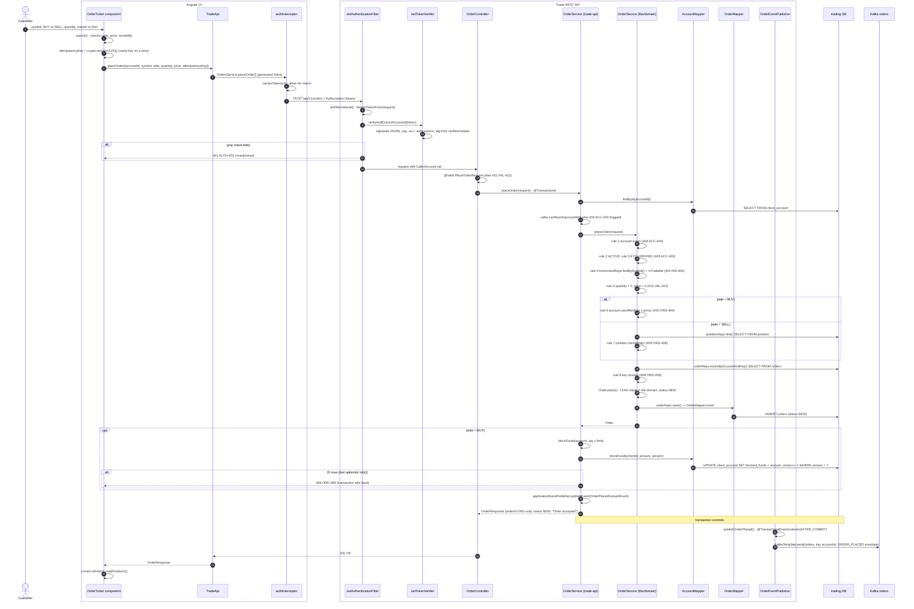
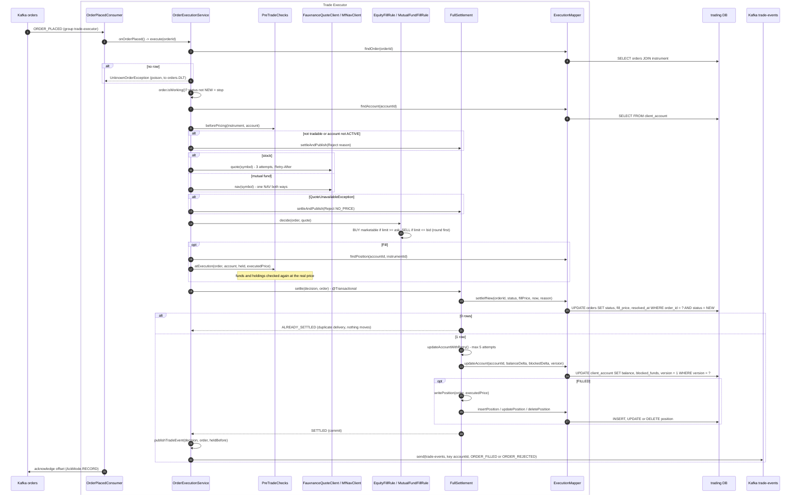

# Flow 2: Place an order (buy and sell)

The Trade REST API **accepts** the order and puts it on Kafka. The Trade Executor **prices and settles** it later. Part A is the accept path. Part B is the execute path. The table at the end shows how a BUY and a SELL differ.

## A. Accept the order (Trade REST API)

## B. Execute the order (Trade Executor)

## BUY compared with SELL

| Step | BUY | SELL |
|---|---|---|
| UI check | `shortfall()`: cost is more than available cash | quantity is more than the holding |
| Domain rule | Rule 6: `account.canAfford(qty x price)`, else `400 ORD-400` | Rule 7: `positionRepo.find()` + `position.canSell(qty)`, else `409 ORD-409` |
| At accept | `OrderService.blockFunds()`: `blocked_funds += qty x limit` | Nothing is reserved (known gap U3) |
| Fill rule | Fill if `limit >= ask`. Pays the **ask**. | Fill if `limit <= bid`. Receives the **bid**. |
| Settle cash on FILLED | `balance -= qty x executed`, `blocked -= qty x limit` | `balance += qty x executed` |
| Settle cash on REJECTED | `blocked -= qty x limit` | No change |
| Position on FILLED | INSERT, or UPDATE with weighted average cost | UPDATE quantity, or DELETE when it reaches 0 |
| Event | `ORDER_FILLED` with `cashDelta < 0` | `ORDER_FILLED` with `cashDelta > 0`, `averageCostAfter` set even at 0 |

## Tables written in this flow

| Table | Writer | How |
|---|---|---|
| `orders` | `OrderMapper.insert`; `ExecutionMapper.settleIfNew` | INSERT NEW; guarded UPDATE out of NEW |
| `client_account` | `AccountMapper.blockFunds`; `ExecutionMapper.updateAccount` | Optimistic lock on `version` |
| `position` | `ExecutionMapper.insertPosition`, `updatePosition`, `deletePosition` | Weighted average on buy. Delete at zero. |

## Why it is built this way

- **`AFTER_COMMIT` publish.** A publish inside the transaction can announce an order that rolls back. After commit, a lost event can be replayed from the table.
- **Key `accountId`.** Kafka keeps order inside one partition. A SELL comes after the BUY that funded it.
- **Guarded update `WHERE status = 'NEW'`.** A duplicate message or a race with cancel gives 0 rows. Nothing moves two times.
- **Check again at execution.** The price moved after accept, so funds and holdings are checked at the executed price.
