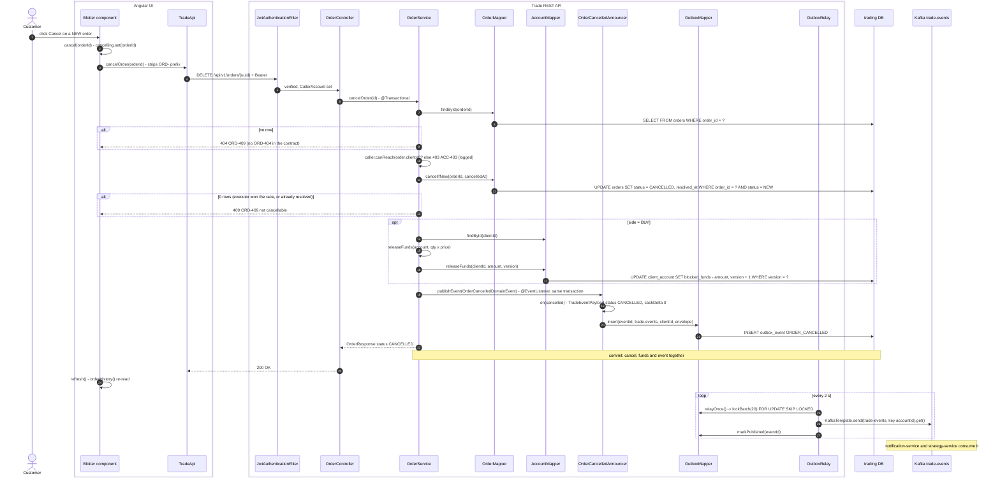
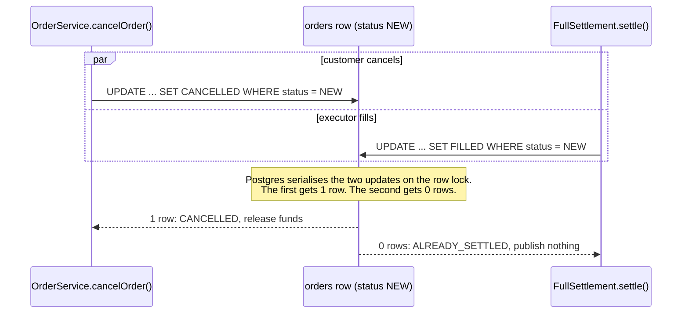

# Flow 3: Cancel an order

A customer can cancel an order only while it is `NEW`. The cancel and the executor can race. The database lets only one of them win. Since Sprint 10, a cancel also announces `ORDER_CANCELLED` on `trade-events` through the outbox, so notifications and strategy hear about it.

## The race with the executor

## Tables written in this flow

| Table | Writer | How |
|---|---|---|
| `orders` | `OrderMapper.cancelIfNew` (`OrderMapper.xml:125`) | Guarded UPDATE `WHERE status = 'NEW'` |
| `client_account` | `AccountMapper.releaseFunds` | BUY only. Optimistic lock on `version`. |
| `outbox_event` | `OutboxMapper.insert`, `markPublished` | Same transaction as the cancel |

## Why it is built this way

- **Release funds only after the guarded update gives 1 row.** Otherwise a cancel that lost the race would release money a fill already used.
- **Outbox, not `AFTER_COMMIT`.** The cancel event commits with the cancel or not at all.
