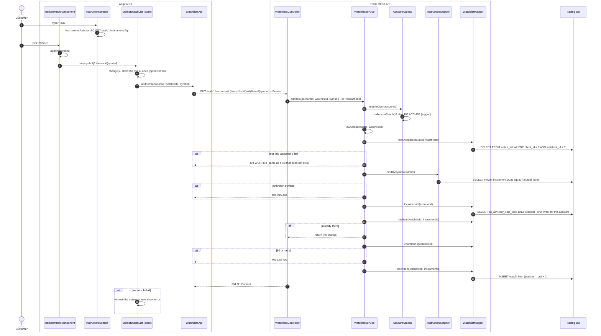
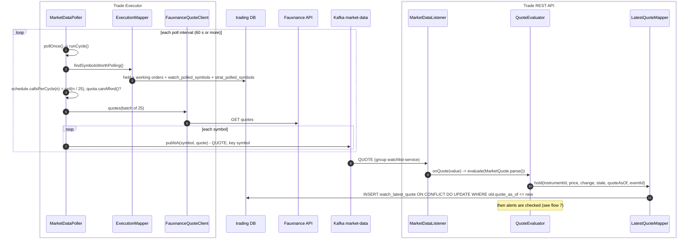
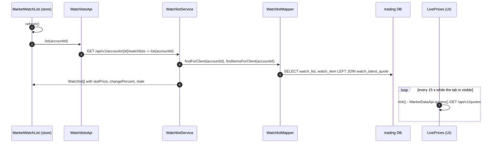

# Flow 4: Watchlist

A customer keeps up to 5 watchlists with up to 50 instruments in each. The list lives on the server (`watch_list`, `watch_item`). Each item shows the last price that the `market-data` consumer stored in `watch_latest_quote`.

Part A adds an instrument. Part B shows how the prices arrive. Part C shows how the screen reads the list.

## A. Add an instrument to a watchlist

## B. How the prices reach the watchlist

The executor's poller prices only symbols that someone needs. The watchlists module owns the view `watch_polled_symbols`. The poller reads that view (decision 0009).

## C. Read the watchlists

## Tables written in this flow

| Table | Writer | How |
|---|---|---|
| `watch_list` | `WatchlistMapper.insert`, `rename`, `delete` | Max 5 for each account, under the advisory lock |
| `watch_item` | `WatchlistMapper.insertItem`, `deleteItem` | Max 50 for each list |
| `watch_latest_quote` | `LatestQuoteMapper.hold` | Upsert only when the quote is newer |

## Why it is built this way

- **Caps (`WatchLimits`).** Without a cap, the alert and item tables grow without limit, and the `market-data` consumer becomes slow.
- **Advisory lock on the account.** Two parallel requests cannot both pass the "count < 5" check.
- **A view for the poller.** The executor does not read the module's tables. The module can change its tables and keep the view.
