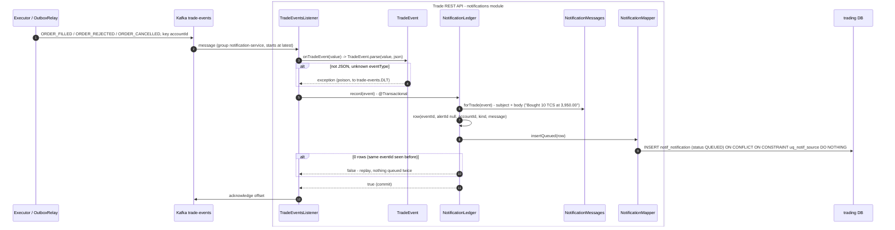
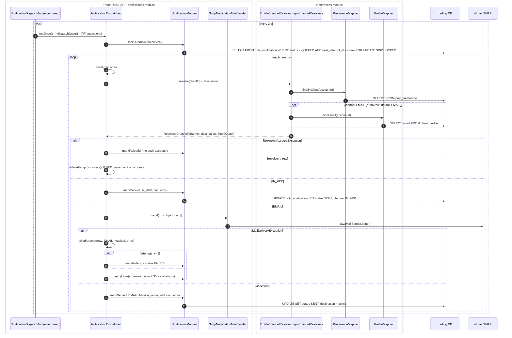
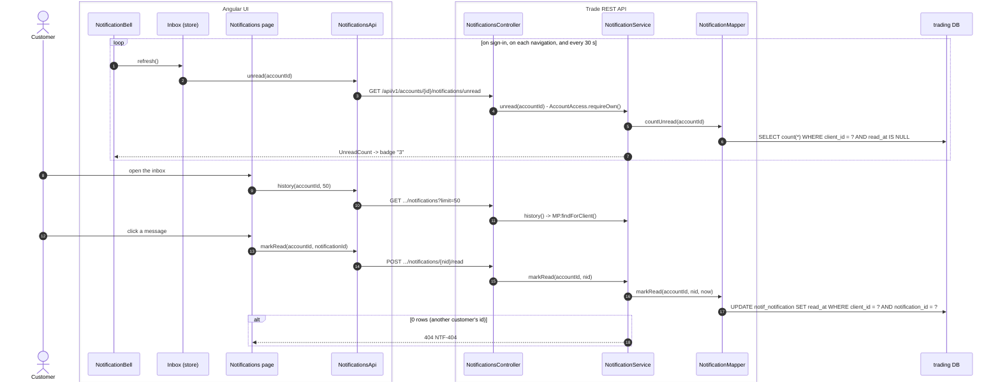
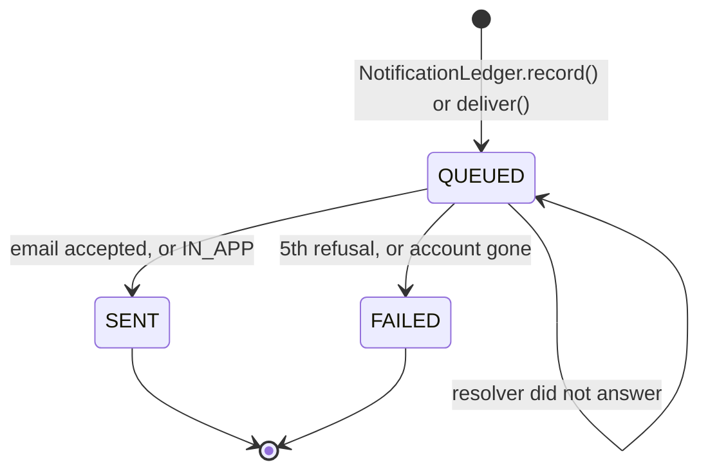

# Flow 5: A notification for each order

Each order result on `trade-events` (`ORDER_FILLED`, `ORDER_REJECTED`, `ORDER_CANCELLED`) becomes one notification. The flow has two halves that do not wait for each other:

1. **Record.** The consumer writes a `QUEUED` row in the ledger, then commits the Kafka offset.
2. **Dispatch.** A separate thread sends due rows on the channel that preferences gives at send time.

A slow mail server never stops a Kafka partition (decision 0006).

## A. Record the event in the ledger

## B. Dispatch on the customer's channel

## C. The bell and the inbox in the UI

## Notification states

## Tables written in this flow

| Table | Writer | How |
|---|---|---|
| `notif_notification` | `NotificationMapper.insertQueued` | `UNIQUE NULLS NOT DISTINCT (event_id, alert_id)` makes a replay a no-op |
| `notif_notification` | `markSent`, `retryLater`, `markFailed` | Under `FOR UPDATE SKIP LOCKED` |
| `notif_notification.read_at` | `markRead` | Only the customer's own rows |

## Why it is built this way

- **Ledger first, send later.** The Kafka offset commits when the row is `QUEUED`, not when Gmail answers.
- **New group starts at `latest`.** A new deployment does not mail a month of old trades.
- **The channel is read at send time.** A change in Settings applies to the next message, also one already queued.
- **The address is stored masked.** A full email address never goes in a log or in the row.
