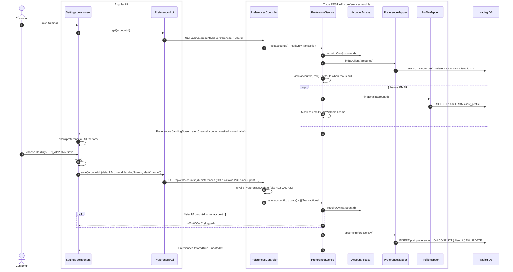
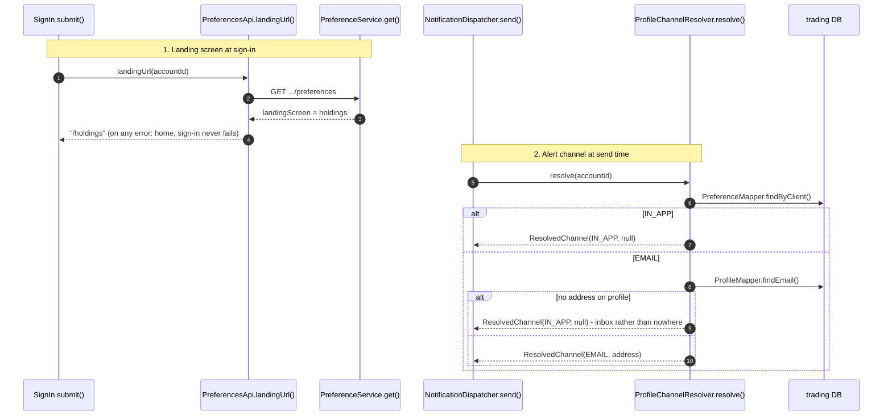

# Flow 6: Preferences

A customer chooses three things in Settings: the default account, the landing screen after sign-in, and the alert channel (`EMAIL` or `IN_APP`). One row in `pref_preference` holds them. With no row, the documented defaults apply: own account, `dashboard`, `EMAIL` (decision 0004).

## A. Read and save Settings

## B. Where the preferences are used

## Tables written in this flow

| Table | Writer | How |
|---|---|---|
| `pref_preference` | `PreferenceMapper.upsert` | One row for each customer. `CHECK (default_account_id = client_id)`. |

## Why it is built this way

- **The email is not copied into `pref_preference`** (decision 0003). It is read from `client_profile` at send time. There is one copy of personal data, and no address that a customer types. This designs out SSRF (A10).
- **`ResolvedChannel.toString()` leaves out the address.** A log line cannot show it.
- **The seam is a Java interface.** No HTTP route resolves a channel, so no customer token can call it.
