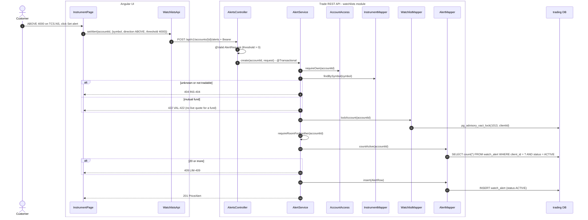
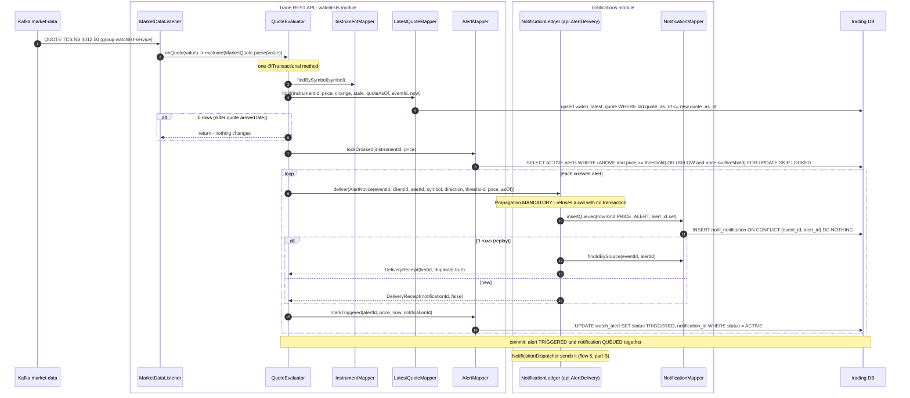
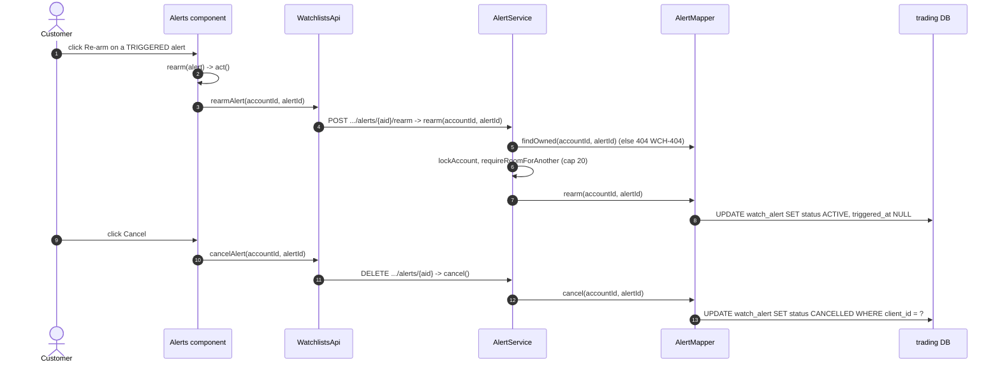
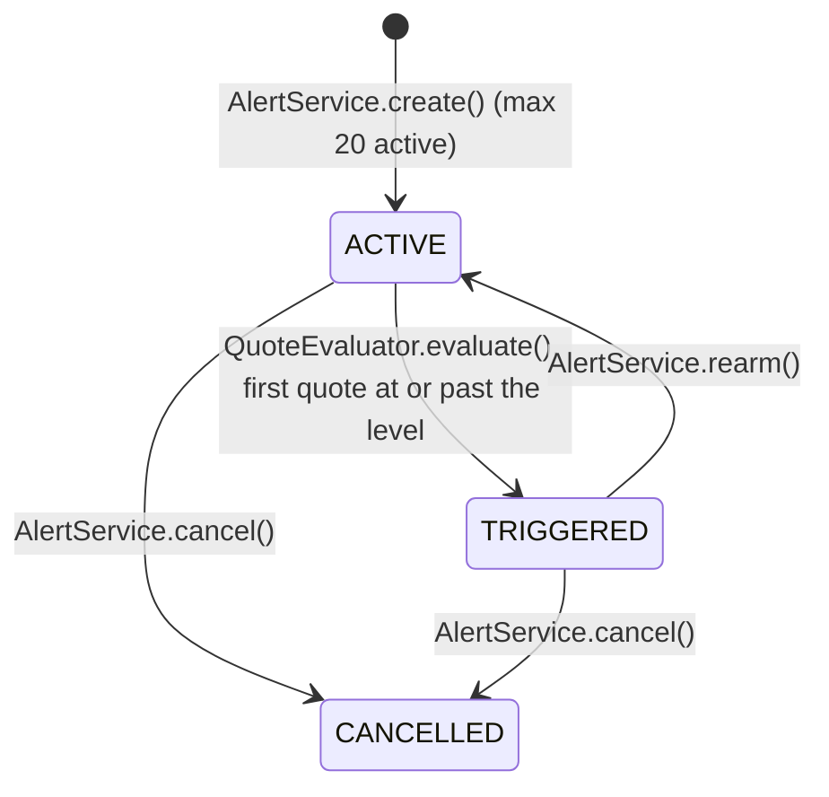

# Flow 7: Price alerts

A customer sets an alert: "tell me when TCS goes ABOVE 4,000". The alert fires one time on the first quote at or past the level. Then it waits until the customer re-arms it (decision 0007). The trigger and the queued notification commit in one transaction (decision 0008).

## A. Set an alert

## B. A quote crosses the level

## C. Re-arm or cancel

## Alert states

## Tables written in this flow

| Table | Writer | How |
|---|---|---|
| `watch_alert` | `AlertMapper.insert`, `markTriggered`, `rearm`, `cancel` | Guarded by `status`. Partial index `ix_watch_alert_active`. |
| `watch_latest_quote` | `LatestQuoteMapper.hold` | Newer quote only |
| `notif_notification` | `NotificationMapper.insertQueued` (through `AlertDelivery`) | Same transaction as the trigger |

## Why it is built this way

- **Fire once.** Firing on every quote past the level sends many messages in a minute.
- **Key `(event_id, alert_id)`.** One quote can cross many customers' alerts. A key on `event_id` alone keeps only the first.
- **`MANDATORY` propagation.** An alert can never show `TRIGGERED` with no notification queued.
- **`SKIP LOCKED`.** Two consumer threads never fire the same alert.
