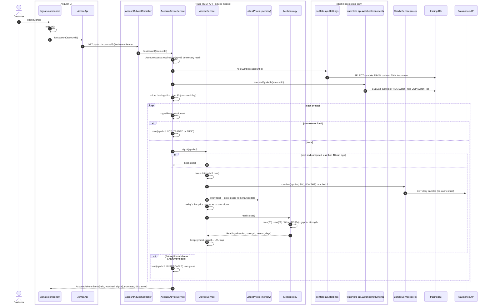
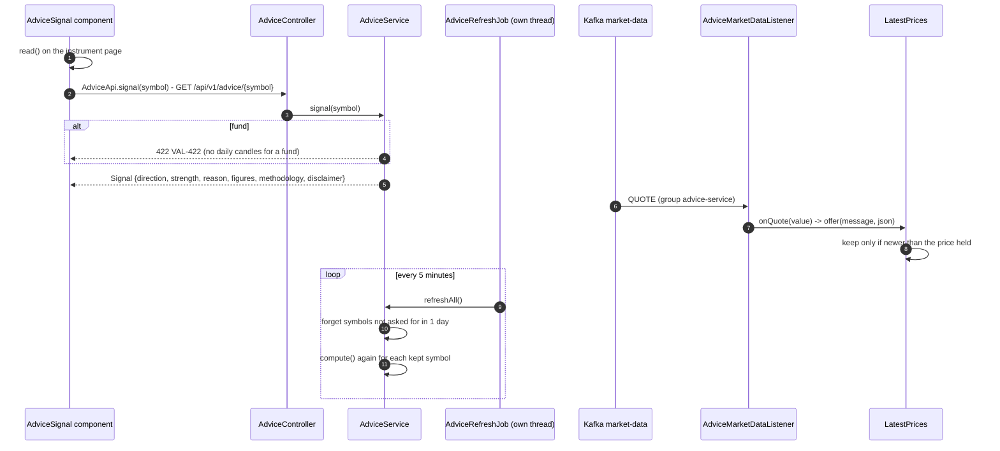
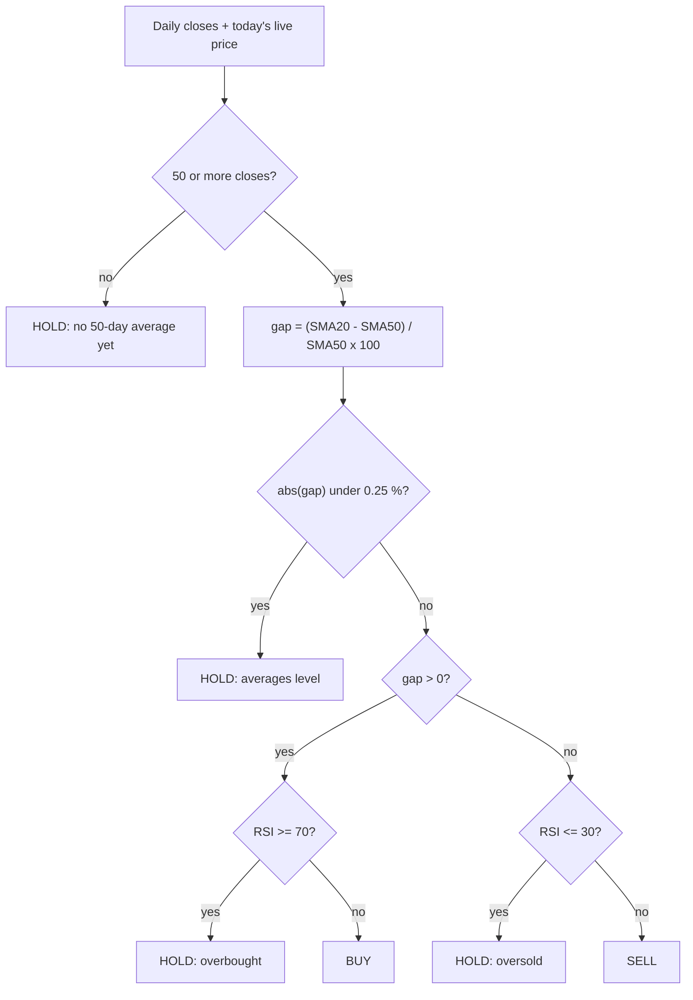

# Flow 8: Trade signals (advice)

The advice module gives a BUY, SELL or HOLD signal for a stock. It uses one methodology: **20-day SMA against 50-day SMA, confirmed by RSI(14)**. Every answer carries the disclaimer: "Information, not advice." The module has no table. Signals live in memory (decision 0015). A customer can ask for one stock, or for every stock they hold or watch (decision 0016).

## A. Signals for the customer's holdings and watchlists

## B. The signal for one stock, and how it stays fresh

## The rule

Strength (0 to 100) = `60 x min(1, |gap| / 4) + 40 x clamp((RSI - 50) / 20)`.

## Tables in this flow

The advice module writes no table. It reads `position` through `Holdings`, `watch_item` through `WatchedInstruments`, and `instrument` through `InstrumentMapper`.

## Why it is built this way

- **One methodology.** One rule that we can explain is better than three that we cannot. A combined score looks like a recommendation.
- **Computed on request, then on a timer, never for each quote.** A page that never asks costs nothing.
- **No signal from bad data.** A fund, a missing chart or a failed price gives "no signal", not a guess.
