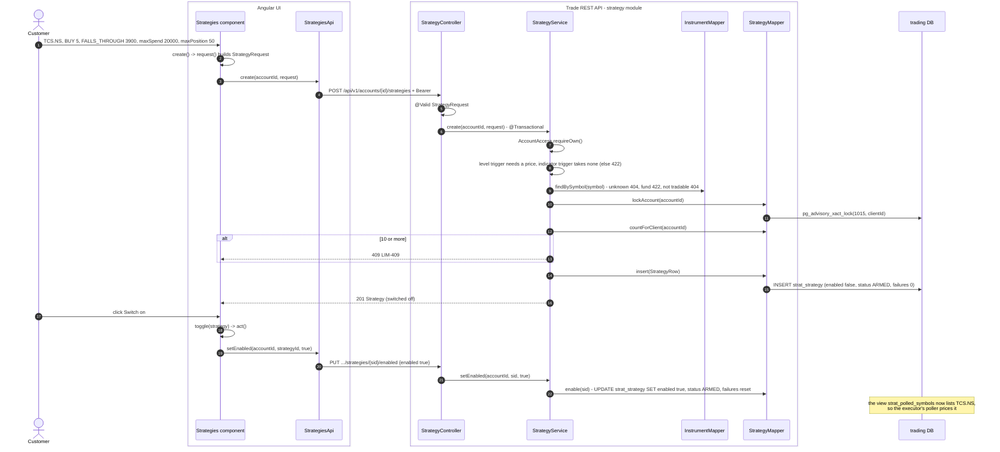
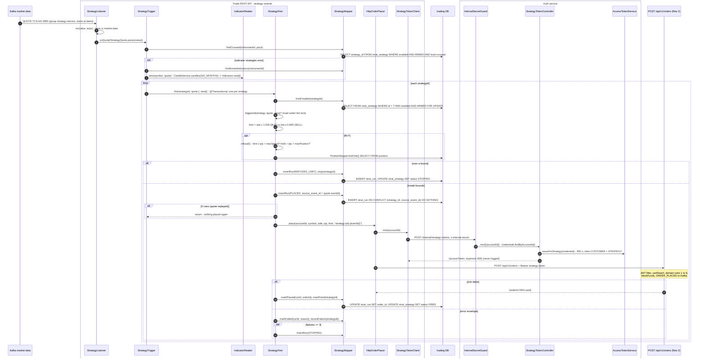
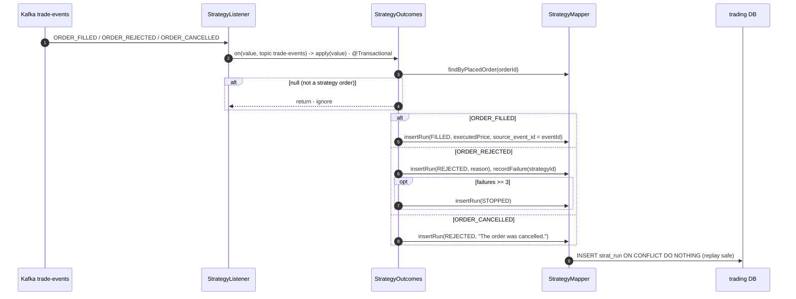
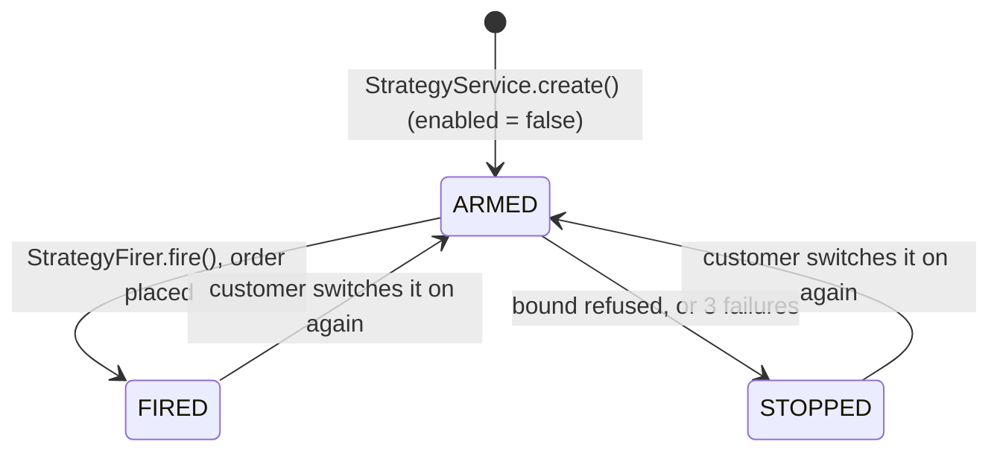

# Flow 9: Automated strategy

A strategy is a rule that places an order when no customer is signed in. Example: "BUY 5 TCS when the price FALLS_THROUGH 3,900, spend at most 20,000, hold at most 50". Four triggers exist: `FALLS_THROUGH`, `RISES_THROUGH` (a price level), `MA_CROSSOVER` and `BOLLINGER` (indicators from daily candles, decision 0017).

A strategy fires through the **public order route** with a **5-minute token** that auth mints (decision 0012). So every order check applies to it.

## A. Create and switch on a strategy

## B. A quote fires the strategy

## C. The order result comes back

## Strategy states

## Tables written in this flow

| Table | Writer | How |
|---|---|---|
| `strat_strategy` | `StrategyMapper.insert`, `enable`, `disable`, `markFired`, `stop`, `recordFailure` | Row lock `FOR UPDATE` while firing |
| `strat_run` | `StrategyMapper.insertRun`, `markPlaced`, `markFailed` | `UNIQUE (strategy_id, source_event_id)` |
| `orders`, `client_account` | the public order route (flow 2) | Same checks as a customer order |

## Why it is built this way

- **The public order route.** Its token check, validation and idempotency key stand between a strategy defect and a real position.
- **A 5-minute token.** It is used at once for one order. A longer life only makes a leak worse.
- **Bounds.** `maxSpend`, `maxPosition` and a stop after 3 failures limit what a wrong rule can spend.
- **Row lock while firing.** A "switch off" that arrives during a firing waits, then applies to the next quote.
- **Group starts at `latest`.** An old quote must never spend money now.
