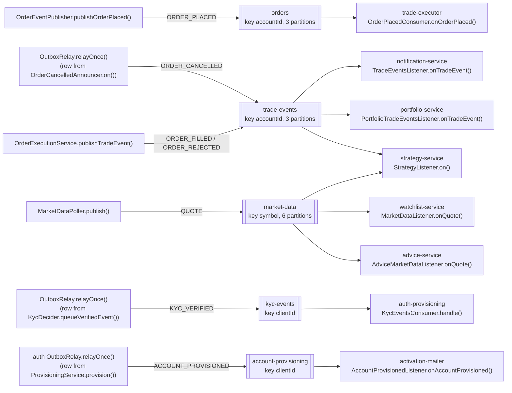
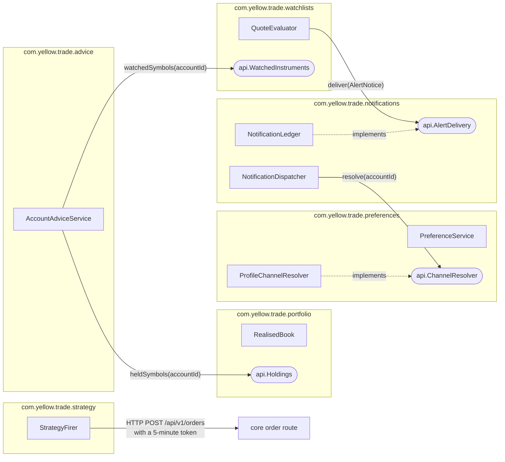

# System architecture

This page shows the full YELLOW platform: the containers, the classes that do the work, and the function that makes each call. The language follows ASD-STE100 (Simplified Technical English).

Source of the diagrams: [`system-architecture.mermaid`](system-architecture.mermaid). Sequence diagrams for each flow are in [`sequences/`](sequences/README.md).

## 1. How to read the diagram

| Mark | Meaning |
|---|---|
| Solid arrow | A synchronous call. The caller waits for the answer. |
| Dotted arrow | An asynchronous call: a Kafka message or a timer. |
| Edge label | The function that makes the call, then the route, topic or table. |
| `group x` | The Kafka consumer group that reads the topic. |
| "Java seam" | A call between two modules through a Java interface. There is no HTTP route for it. |

## 2. Containers

| Container | Technology | Port | Job |
|---|---|---|---|
| Angular UI | Angular 21, standalone components, signals | 4200 | Screens. Calls the APIs through generated clients. |
| Trade REST API | Java 21, Spring Boot, MyBatis | 8085 | Accepts orders. Owns accounts, onboarding, KYC, payments, activation email and the six Sprint 10 modules. |
| Trade Executor | Java 21, Spring Boot, MyBatis | 8081 | Prices and settles orders. Polls market data. |
| Auth service | NestJS, argon2, kafkajs, ioredis | 3000 | Credentials, tokens, account provisioning, activation tokens. |
| PostgreSQL 16 | two databases: `trading`, `auth` | 5432 | One role for each service. |
| Kafka 3.8 | KRaft, one broker | 9092 | Five topics and their dead-letter topics. |
| Redis Cloud | hosted | - | Login throttle counter. |
| Python ETL | pandas, DuckDB | - | Analytics. Reads `trading` with a read-only role. |

## 3. System diagram with function calls

```mermaid
flowchart LR
    Customer([Customer browser])

    subgraph UI["Angular UI :4200"]
        direction TB
        UI_APPLY["Apply.submit()"]
        UI_SIGN["SignIn.submit()"]
        UI_TICKET["OrderTicket.submit()"]
        UI_BLOT["Blotter.cancel()"]
        UI_MW["MarketWatchList.add()"]
        UI_ALERT["InstrumentPage / Alerts.rearm()"]
        UI_BELL["NotificationBell -> Inbox.refresh()"]
        UI_SET["Settings.save()"]
        UI_SIG["Signals.refresh() / AdviceSignal.read()"]
        UI_STR["Strategies.create() / toggle()"]
        UI_HOLD["Holdings / Dashboard"]
        INT["authInterceptor()<br/>Bearer only for allow list"]
    end

    subgraph API["Trade REST API :8085 (Spring Boot)"]
        direction TB
        FIL["JwtAuthenticationFilter.doFilterInternal()<br/>-> JwtTokenVerifier.verifyAndExtractAccountId()"]
        ACC["AccountAccess.requireOwn()<br/>CallerAccount.canReach()"]
        subgraph CORE["core"]
            ONB["OnboardingController.apply()<br/>-> OnboardingService.apply()"]
            KYCJ["KycVerificationJob.run()<br/>-> KycDecider.decide()"]
            ORD["OrderController -> OrderService<br/>.placeOrder() / .cancelOrder()"]
            DOM["domain OrderService.placeOrder()<br/>rules 1 to 8"]
            PUB["OrderEventPublisher.publishOrderPlaced()<br/>AFTER_COMMIT"]
            ANN["OrderCancelledAnnouncer.on()"]
            REL["OutboxRelay.relayOnce()"]
            ACT["AccountProvisionedListener<br/>-> ActivationService.handle()"]
            PRICE["PriceService / CandleService"]
        end
        subgraph MOD["Sprint 10 modules"]
            PREF["PreferenceService.save()<br/>ProfileChannelResolver.resolve()"]
            NOTIF["NotificationLedger.record() / deliver()<br/>NotificationDispatcher.dispatchOnce()"]
            WATCH["WatchlistService.addItem()<br/>AlertService.create()<br/>QuoteEvaluator.evaluate()"]
            PF["PortfolioService.summary()<br/>RealisedBook.book()"]
            ADV["AdviceService.signal()<br/>AccountAdviceService.forAccount()"]
            STR["StrategyService.create()<br/>StrategyTrigger.onQuote()<br/>StrategyFirer.fire()<br/>StrategyOutcomes.apply()"]
        end
    end

    subgraph EXE["Trade Executor :8081"]
        direction TB
        OPC["OrderPlacedConsumer.onOrderPlaced()"]
        OES["OrderExecutionService.execute()<br/>PreTradeChecks / FillRule.decide()"]
        SET["FullSettlement.settle()"]
        POLL["MarketDataPoller.runCycle()"]
    end

    subgraph AUTH["Auth service :3000 (NestJS)"]
        direction TB
        AC["AuthController.login() / register() / refresh()"]
        KEC["KycEventsConsumer.handle()<br/>-> ProvisioningService.provision()"]
        AOR["OutboxRelay.relayOnce()"]
        INTC["InternalController.mint()<br/>StrategyTokenController.mint()<br/>InternalSecretGuard"]
        APG["ActivationPageController.submit()"]
    end

    subgraph K["Kafka (KRaft)"]
        T_ORD[["orders"]]
        T_TE[["trade-events"]]
        T_MD[["market-data"]]
        T_KYC[["kyc-events"]]
        T_AP[["account-provisioning"]]
    end

    PG[("PostgreSQL db trading")]
    APG_DB[("PostgreSQL db auth")]
    REDIS[("Redis: login throttle")]
    FX["Fauxnance API"]
    NAV["MF NAV API"]
    SMTP["Gmail SMTP"]

    Customer --> UI
    UI_APPLY -- "OnboardingApi.apply()<br/>POST /onboarding/applications" --> ONB
    UI_SIGN -- "AuthApi.signIn()<br/>POST /auth/login" --> AC
    UI_TICKET -- "TradeApi.placeOrder()<br/>POST /api/v1/orders" --> INT
    UI_BLOT -- "TradeApi.cancelOrder()<br/>DELETE /api/v1/orders/id" --> INT
    UI_MW -- "WatchlistsApi.addItem()<br/>PUT .../watchlists/w/items/s" --> INT
    UI_ALERT -- "WatchlistsApi.setAlert() / rearmAlert()" --> INT
    UI_BELL -- "NotificationsApi.unread()<br/>every 30 s" --> INT
    UI_SET -- "PreferencesApi.save()<br/>PUT .../preferences" --> INT
    UI_SIG -- "AdviceApi.forAccount() / signal()" --> INT
    UI_STR -- "StrategiesApi.create() / setEnabled()" --> INT
    UI_HOLD -- "PortfolioApi summary / positions" --> INT
    INT -- "Authorization: Bearer JWT" --> FIL
    FIL --> ACC
    ACC --> ORD
    ACC --> MOD
    ORD --> DOM
    DOM -- "OrderMapper.insert()" --> PG
    ORD -- "AccountMapper.blockFunds()" --> PG
    ORD -. "publishEvent()" .-> PUB
    ORD -- "publishEvent() same tx" --> ANN
    ANN -- "OutboxMapper.insert()" --> PG
    PUB -. "KafkaTemplate.send() key accountId" .-> T_ORD
    ONB -- "OnboardingMapper.insert*()" --> PG
    KYCJ -- "KycMapper.decide()<br/>OutboxMapper.insert()" --> PG
    REL -- "OutboxMapper.lockBatch()" --> PG
    REL -. "send() kyc-events / trade-events" .-> T_KYC
    REL -.-> T_TE
    T_ORD -. "group trade-executor" .-> OPC
    OPC --> OES
    OES -- "FauxnanceQuoteClient.quote()" --> FX
    OES -- "MfNavClient.nav()" --> NAV
    OES --> SET
    SET -- "ExecutionMapper.settleIfNew()<br/>updateAccount() / *Position()" --> PG
    OES -. "publishTradeEvent()" .-> T_TE
    POLL -- "findSymbolsWorthPolling()" --> PG
    POLL -- "quotes() batch 25" --> FX
    POLL -. "publish() key symbol" .-> T_MD
    T_KYC -. "group auth-provisioning" .-> KEC
    KEC -- "INSERT provisioned_account<br/>+ outbox_event" --> APG_DB
    AOR -. "account-provisioning" .-> T_AP
    T_AP -. "group activation-mailer" .-> ACT
    ACT -- "AuthTokenClient.mintToken()<br/>POST /internal/activation-tokens" --> INTC
    ACT -- "SmtpActivationMailSender.send()" --> SMTP
    INTC --> APG_DB
    APG -- "AuthService.register()" --> APG_DB
    AC --> APG_DB
    AC -- "Lua INCR + PEXPIRE" --> REDIS
    T_TE -. "group notification-service" .-> NOTIF
    T_TE -. "group portfolio-service" .-> PF
    T_TE -. "group strategy-service" .-> STR
    T_MD -. "group watchlist-service" .-> WATCH
    T_MD -. "group advice-service" .-> ADV
    T_MD -. "group strategy-service" .-> STR
    WATCH -- "AlertDelivery.deliver()<br/>Java seam, MANDATORY tx" --> NOTIF
    NOTIF -- "ChannelResolver.resolve()<br/>Java seam" --> PREF
    NOTIF -- "SmtpNotificationMailSender.send()" --> SMTP
    STR -- "StrategyTokenClient.mint()<br/>POST /internal/strategy-tokens" --> INTC
    STR -- "HttpOrderPlacer.place()<br/>POST /api/v1/orders" --> FIL
    ADV -- "Holdings.heldSymbols()<br/>WatchedInstruments.watchedSymbols()" --> PF
    ADV --> PRICE
    PF --> PRICE
    PRICE --> FX
    PRICE --> NAV
    MOD --> PG
```

## 4. Event view: who produces and who consumes

The UI never connects to Kafka. Each module has its own consumer group, so each module gets every message (decision 0013).

## 5. Module boundaries inside the Trade REST API

The six Sprint 10 extensions are packages inside one process. They are not separate services (decision 0001). A module can use another module only through that module's `api` package. `ModuleBoundaryTest` stops the build if a module uses anything else.

| Module | Table prefix | Consumer group | Seam it offers | Seam it uses |
|---|---|---|---|---|
| preferences | `pref_` | none | `ChannelResolver` | none |
| notifications | `notif_` | `notification-service` | `AlertDelivery` | `ChannelResolver` |
| watchlists | `watch_` | `watchlist-service` | `WatchedInstruments` | `AlertDelivery` |
| portfolio | `pf_` | `portfolio-service` | `Holdings` | none |
| advice | none (memory only) | `advice-service` | none | `Holdings`, `WatchedInstruments` |
| strategy | `strat_` | `strategy-service` | none | the public order route |

## 6. Design rules that hold the system together

1. **Accept fast, execute later.** `OrderService.placeOrder()` validates and records. The executor prices and settles later.
2. **At-least-once delivery, idempotent consumers.** Kafka can deliver a message two times. Each consumer is safe when that occurs.
3. **The database is the last guard.** CHECK constraints, unique keys and `UPDATE ... WHERE status = 'NEW'` stop bad states.
4. **The token decides the account.** Each route compares the path account with the `accountId` claim. A mismatch gives `403 ACC-403`.
5. **Transactional outbox** for `KYC_VERIFIED`, `ACCOUNT_PROVISIONED` and `ORDER_CANCELLED`. The event commits with the change.
