# YELLOW Trading Platform: Architecture Handout

For the group presentation. Read it from start to end one time. Then use the section headings to find a topic fast.

The language follows ASD-STE100 (Simplified Technical English): short sentences, active voice, one idea in each sentence, and the same word for the same thing every time. Code and SQL are real excerpts from the repository, with `file:line`. Code that is not in the repository is marked **illustration**.

---

## 0. The prompt that made this handout

The request was converted to a Role, Context, Input, Output, Constraints prompt. Then this handout was written from that prompt.

| Part | Text |
|---|---|
| **Role** | You are a senior software architect. You know this repository completely. You coach a team member who must present the full architecture to reviewers tomorrow and answer any question about it. |
| **Context** | The application is the YELLOW trading platform (capstone, SE3 Team 2). It has an Angular UI, a Trade REST API (Spring Boot, Java), a Trade Executor (Spring Boot), an Auth service (NestJS), PostgreSQL, Kafka, a hosted Redis, and a Python analytics ETL. Sprint 10 added six extension modules inside the Trade REST API. Reviewers ask "why X", then "what else could you do", then core concepts. |
| **Input** | The repository: source code, SQL migrations, `contracts/`, `docs/` (decision logs, security reviews, runbooks), `docker-compose.yml`. |
| **Output** | One Markdown handout with: (1) the architecture and the reason for each decision, (2) the flow of each core feature and each extension, (3) the database schema, how tables connect and which component writes them, (4) the Kafka topics and how they interact, (5) the algorithms and why we chose them, (6) the DTO, error and auth schemes, (7) edge cases: how we solve them, and how to solve the ones we do not solve, (8) likely reviewer questions with answers. Use as many Mermaid diagrams as possible. Put a code snippet under each concept. |
| **Constraints** | Use ASD-STE100 style: simple words, short sentences, active voice. Use only facts from the repository; mark illustrations. Give `file:line` for real code. Say clearly when something is not built or not solved. Do not include secrets. |

---

## 1. The one-minute pitch

YELLOW is a stock and mutual-fund trading platform for Indian customers (INR only).

- A customer applies, passes KYC, gets an activation email, and makes a login.
- The customer deposits money, places buy and sell orders, and sees holdings and profit or loss.
- The Trade REST API **accepts** an order and puts it on Kafka. A separate Trade Executor **prices and settles** it.
- The result goes on Kafka again. Many consumers read it: notifications, portfolio, strategy, analytics.
- Sprint 10 added six extensions as modules inside the Trade REST API: preferences, notifications, watchlists and price alerts, portfolio and P&L, trade advice, and automated strategies.

Three ideas hold the design together:

1. **Accept fast, execute later.** The HTTP request only validates and records. Execution is asynchronous.
2. **At-least-once everywhere, idempotent everywhere.** Kafka can deliver a message two times. Every consumer is safe when that occurs.
3. **The database is the last guard.** CHECK constraints, unique keys and guarded `UPDATE ... WHERE status = 'NEW'` stop bad states even when code has a defect.

---

## 2. The system at a glance

### 2.1 Context diagram

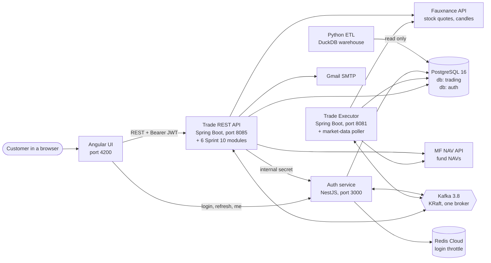
```mermaid
flowchart LR
    Customer([Customer in a browser])
    UI["Angular UI<br/>port 4200"]
    API["Trade REST API<br/>Spring Boot, port 8085<br/>+ 6 Sprint 10 modules"]
    EXE["Trade Executor<br/>Spring Boot, port 8081<br/>+ market-data poller"]
    AUTH["Auth service<br/>NestJS, port 3000"]
    PG[("PostgreSQL 16<br/>db: trading<br/>db: auth")]
    K{{"Kafka 3.8<br/>KRaft, one broker"}}
    R[("Redis Cloud<br/>login throttle")]
    FX["Fauxnance API<br/>stock quotes, candles"]
    NAV["MF NAV API<br/>fund NAVs"]
    SMTP["Gmail SMTP"]
    ETL["Python ETL<br/>DuckDB warehouse"]

    Customer --> UI
    UI -- "REST + Bearer JWT" --> API
    UI -- "login, refresh, me" --> AUTH
    API --> PG
    EXE --> PG
    AUTH --> PG
    AUTH --> R
    API <--> K
    EXE <--> K
    AUTH <--> K
    EXE --> FX
    EXE --> NAV
    API --> FX
    API --> NAV
    API --> SMTP
    API -- "internal secret" --> AUTH
    ETL -- "read only" --> PG
```

### 2.2 Containers and ports (`docker-compose.yml`)

| Container | Tech | Port | Owns | Talks to |
|---|---|---|---|---|
| `trade-api` | Java, Spring Boot, MyBatis | 8085 | orders, accounts, onboarding, KYC, payments, activation mailer, 6 modules | Postgres (`trading`), Kafka, Auth (internal), Fauxnance, MF NAV, SMTP |
| `executor` | Java, Spring Boot, MyBatis | 8081 | order execution, settlement, market-data poller | Postgres (`trading`), Kafka, Fauxnance, MF NAV |
| `auth` | NestJS, kafkajs, pg, argon2, ioredis | 3000 | credentials, tokens, provisioning, activation tokens | Postgres (`auth`), Kafka, Redis |
| `postgres` | PostgreSQL 16 | 5432 | two databases: `trading`, `auth` | - |
| `kafka` | Apache Kafka 3.8, KRaft | 9092 (host), 29092 (internal) | topics | - |
| UI | Angular (standalone components, signals) | 4200 | screens | Trade API, Auth |
| ETL | Python, pandas, DuckDB | - | analytics warehouse | Postgres read only |

Note: inside Docker, a service uses `kafka:29092`, not `localhost`. Inside a container, `localhost` is that container.

### 2.3 Deployment and start order

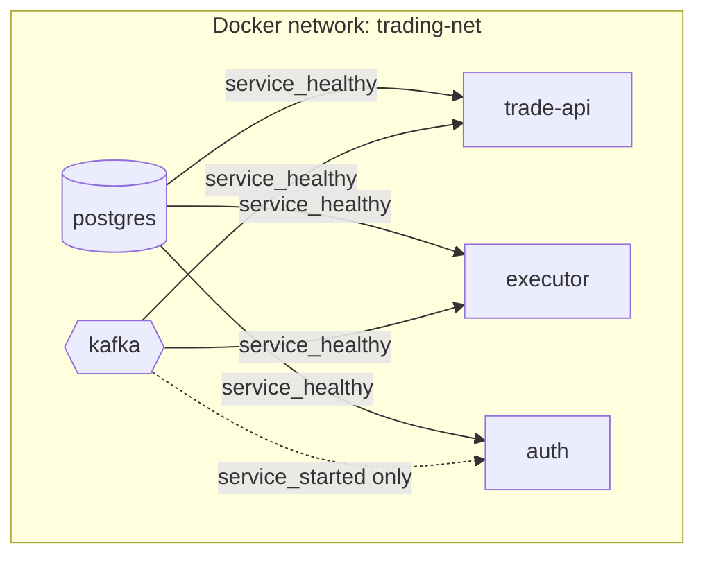
```mermaid
flowchart TB
    subgraph net["Docker network: trading-net"]
        PG[(postgres)]
        KF{{kafka}}
        API[trade-api]
        EX[executor]
        AU[auth]
    end
    PG -- "service_healthy" --> API
    KF -- "service_healthy" --> API
    PG -- "service_healthy" --> EX
    KF -- "service_healthy" --> EX
    PG -- "service_healthy" --> AU
    KF -. "service_started only" .-> AU
```

Why auth waits only for `service_started` on Kafka: logins must work when the broker is down. The auth outbox catches up later (`docker-compose.yml`, auth `depends_on`).

Why Postgres has a custom health check: the server is healthy only after all init scripts ran to the end. Without this, a failed init restarts into an empty database that reports healthy (`data/db/init/healthcheck.sh`).

---

## 3. Architecture decisions and why

### 3.1 The big decisions

| # | Decision | Why | Alternative we did not take |
|---|---|---|---|
| A1 | **Split accept and execute** with Kafka (`orders` topic) | Real execution takes time, can fail part way, and must survive a restart. Many parties need the result. | One HTTP call that validates, fills and writes. It works only when nothing real occurs. |
| A2 | **Separate Auth service with its own database** | Only one component sees a password. A compromise of auth does not give a connection to trading data. | Credentials in the trading database (removed by migration `005_drop_client_auth.sql`). |
| A3 | **One Postgres instance, two databases, one role per service** | `infra/README.md` allows one Postgres. Roles `trading_app`, `analytics_ro`, `auth_app`; `CONNECT` revoked from `PUBLIC`. | Superuser for all services (was the case before Sprint 9; fixed). |
| A4 | **Shared domain library** `libs/domain` | Order rules are plain Java. Unit tests run with in-memory repositories. Both services use the same entities. | Rules copied into each service. |
| A5 | **Contract first** (`contracts/*.yaml`, `services/trade-api/openapi/*.yaml`) | The UI client is generated from OpenAPI. A contract test fails the build on drift. | Code first; the UI guesses the shape. |
| A6 | **Sprint 10 extensions are modules, not services** (decision 0001) | The brief and the binding portfolio contract say so. One token filter already protects `/api/v1/`. No new ports, images or JWT verifiers. | Six services: six Dockerfiles, six verifiers, service credentials for each seam. |
| A7 | **Module seams are Java interfaces, not HTTP routes** (0002) | A route that does not exist cannot be called with a customer token. | Internal HTTP route behind a secret. |
| A8 | **One consumer group per module** (0013) | Each module sees the full stream with its own offsets. | One shared group: modules split partitions and "lose" messages at random. |
| A9 | **Transactional outbox** for `KYC_VERIFIED`, `ACCOUNT_PROVISIONED`, `ORDER_CANCELLED` | The event commits with the change or not at all. A broker outage delays, but never loses, an event. | Publish inside the transaction (can announce a rollback), or after it (can lose the event). |
| A10 | **Guarded state transition** instead of a processed-events table in the executor | `UPDATE orders ... WHERE status = 'NEW'` makes a duplicate a no-op, with no extra table. | Processed-events table; Kafka exactly-once transactions. |
| A11 | **Optimistic locking** on `client_account.version` | No row lock held across the request. A conflict is rare and we retry. | `SELECT ... FOR UPDATE` on every order. |
| A12 | **UUID order id made in the domain** (`002_api_alignment.sql`) | The id exists before the insert, so the Kafka event and retries carry it. | Database identity column; id known only after insert. |
| A13 | **Trade API on 8085, not 8080** (0014) | Team's Windows setup since Sprint 9. Routes and fields bind; the port is configuration. | Move to 8080 and break working setups. |

### 3.2 Module layout inside the Trade REST API

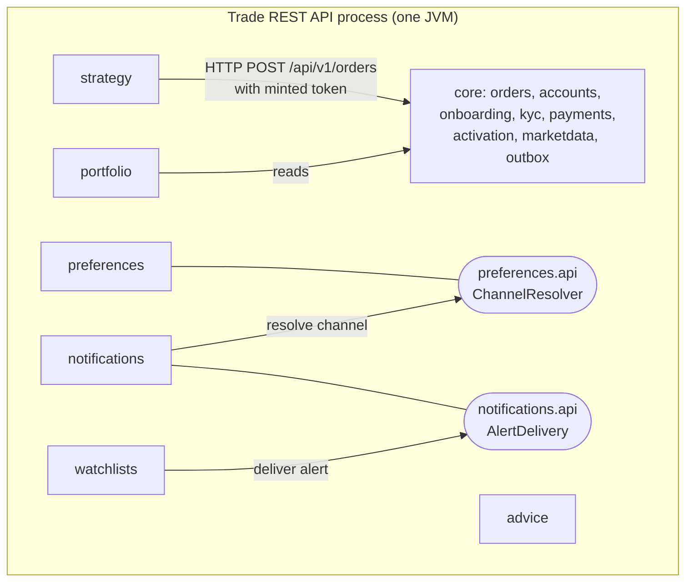
```mermaid
flowchart LR
    subgraph TradeAPI["Trade REST API process (one JVM)"]
        direction LR
        CORE["core: orders, accounts,<br/>onboarding, kyc, payments,<br/>activation, marketdata, outbox"]
        PREF["preferences"]
        NOTIF["notifications"]
        WATCH["watchlists"]
        PF["portfolio"]
        ADV["advice"]
        STR["strategy"]
        PREF_API(["preferences.api<br/>ChannelResolver"])
        NOTIF_API(["notifications.api<br/>AlertDelivery"])
    end
    PREF --- PREF_API
    NOTIF --- NOTIF_API
    NOTIF -- "resolve channel" --> PREF_API
    WATCH -- "deliver alert" --> NOTIF_API
    STR -- "HTTP POST /api/v1/orders<br/>with minted token" --> CORE
    PF -- "reads" --> CORE
```

`ModuleBoundaryTest` fails the build if a module imports anything from another module except its `api` package, or names another module's tables. Each module has a table prefix: `pref_`, `notif_`, `watch_`, `pf_`, `strat_` (advice has no table).

---

## 4. Core flows

### 4.1 Onboarding to first login (Sprints 8 and 9)

This is the longest flow. It crosses three services and three topics.

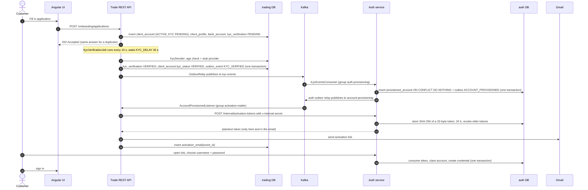
```mermaid
sequenceDiagram
    autonumber
    actor C as Customer
    participant UI as Angular UI
    participant API as Trade REST API
    participant DB as trading DB
    participant K as Kafka
    participant AU as Auth service
    participant ADB as auth DB
    participant M as Gmail

    C->>UI: Fill in application
    UI->>API: POST /onboarding/applications
    API->>DB: insert client_account (ACTIVE, KYC PENDING), client_profile, bank_account, kyc_verification PENDING
    API-->>UI: 202 Accepted (same answer for a duplicate)
    Note over API: KycVerificationJob runs every 10 s, waits KYC_DELAY 30 s
    API->>DB: KycDecider: age check + stub provider
    API->>DB: kyc_verification VERIFIED, client_account.kyc_status VERIFIED, outbox_event KYC_VERIFIED (one transaction)
    API->>K: OutboxRelay publishes to kyc-events
    K->>AU: KycEventsConsumer (group auth-provisioning)
    AU->>ADB: insert provisioned_account ON CONFLICT DO NOTHING + outbox ACCOUNT_PROVISIONED (one transaction)
    AU->>K: auth outbox relay publishes to account-provisioning
    K->>API: AccountProvisionedListener (group activation-mailer)
    API->>AU: POST /internal/activation-tokens with x-internal-secret
    AU->>ADB: store SHA-256 of a 32-byte token, 24 h, revoke older tokens
    AU-->>API: plaintext token (only here and in the email)
    API->>M: send activation link
    API->>DB: insert activation_email(event_id)
    C->>AU: open link, choose username + password
    AU->>ADB: consume token, claim account, create credential (one transaction)
    C->>UI: sign in
```

Why this shape:

- **Registration needs an activation token, not an account number.** In Sprint 8, anyone who guessed a provisioned number could claim it. Now the account comes from the token, and the token goes only to the email the customer controls (`docs/security/sprint-08-auth-review.md`, A01).
- **No token on Kafka.** The token is a credential. It crosses from auth to the mailer over an internal HTTP route only (`contracts/kafka-topics.md`).
- **Duplicate application gives the same `202`.** A different answer would tell an attacker that a PAN or email belongs to a customer.

KYC states:

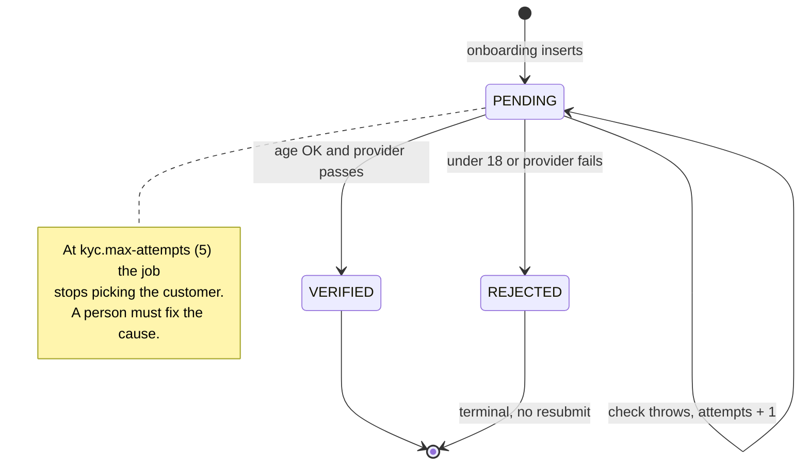
```mermaid
stateDiagram-v2
    [*] --> PENDING : onboarding inserts
    PENDING --> VERIFIED : age OK and provider passes
    PENDING --> REJECTED : under 18 or provider fails
    PENDING --> PENDING : check throws, attempts + 1
    note right of PENDING
      At kyc.max-attempts (5) the job
      stops picking the customer.
      A person must fix the cause.
    end note
    VERIFIED --> [*]
    REJECTED --> [*] : terminal, no resubmit
```

The database holds the rule, not only the code (`data/db/migrations/007_kyc.sql`):

```sql
CONSTRAINT ck_kyc_verification_decided_at
    CHECK ((status = 'PENDING') = (decided_at IS NULL)),
CONSTRAINT ck_kyc_verification_reason
    CHECK ((status = 'REJECTED') = (reason IS NOT NULL))
```

The decision and the event commit together (`services/trade-api/src/main/java/com/yellow/trade/kyc/KycDecider.java:66`):

```java
if (kyc.decide(clientId, status.name(), verdict.reason(), write(verdict.checks())) == 0) {
    return Optional.empty();          // another run decided first
}
if (kyc.setAccountKycStatus(clientId, status.name()) == 0) {
    throw new IllegalStateException(...); // rolls the decision back
}
if (status == KycStatus.VERIFIED) {
    queueVerifiedEvent(clientId);     // outbox row, same transaction
}
```

### 4.2 Sign in and stay signed in

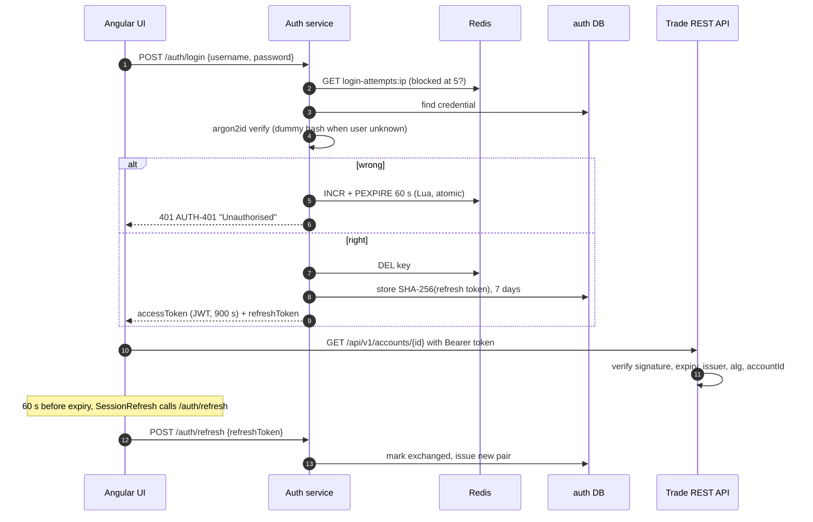
```mermaid
sequenceDiagram
    autonumber
    participant UI as Angular UI
    participant AU as Auth service
    participant R as Redis
    participant ADB as auth DB
    participant API as Trade REST API

    UI->>AU: POST /auth/login {username, password}
    AU->>R: GET login-attempts:ip (blocked at 5?)
    AU->>ADB: find credential
    AU->>AU: argon2id verify (dummy hash when user unknown)
    alt wrong
        AU->>R: INCR + PEXPIRE 60 s (Lua, atomic)
        AU-->>UI: 401 AUTH-401 "Unauthorised"
    else right
        AU->>R: DEL key
        AU->>ADB: store SHA-256(refresh token), 7 days
        AU-->>UI: accessToken (JWT, 900 s) + refreshToken
    end
    UI->>API: GET /api/v1/accounts/{id} with Bearer token
    API->>API: verify signature, expiry, issuer, alg, accountId
    Note over UI: 60 s before expiry, SessionRefresh calls /auth/refresh
    UI->>AU: POST /auth/refresh {refreshToken}
    AU->>ADB: mark exchanged, issue new pair
```

Full detail is in [section 7, Auth scheme](#7-auth-scheme).

### 4.3 Place an order

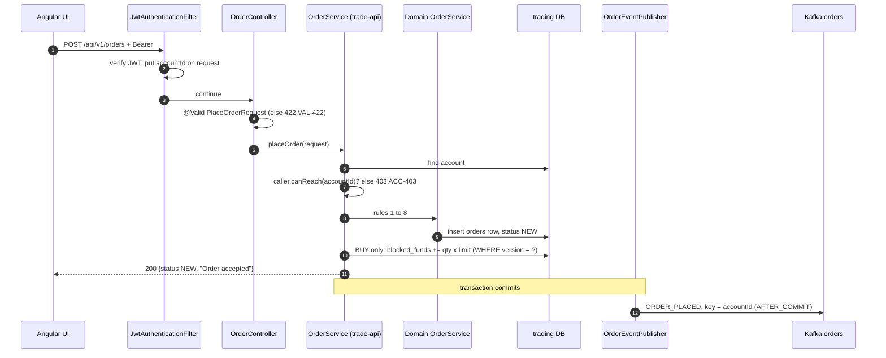
```mermaid
sequenceDiagram
    autonumber
    participant UI as Angular UI
    participant F as JwtAuthenticationFilter
    participant OC as OrderController
    participant OS as OrderService (trade-api)
    participant D as Domain OrderService
    participant DB as trading DB
    participant P as OrderEventPublisher
    participant K as Kafka orders

    UI->>F: POST /api/v1/orders + Bearer
    F->>F: verify JWT, put accountId on request
    F->>OC: continue
    OC->>OC: @Valid PlaceOrderRequest (else 422 VAL-422)
    OC->>OS: placeOrder(request)
    OS->>DB: find account
    OS->>OS: caller.canReach(accountId)? else 403 ACC-403
    OS->>D: rules 1 to 8
    D->>DB: insert orders row, status NEW
    OS->>DB: BUY only: blocked_funds += qty x limit (WHERE version = ?)
    OS-->>UI: 200 {status NEW, "Order accepted"}
    Note over OS,P: transaction commits
    P->>K: ORDER_PLACED, key = accountId (AFTER_COMMIT)
```

The domain rules, in order (`libs/domain/src/main/java/com/yellow/services/OrderService.java:38`):

| Rule | Check | Error |
|---|---|---|
| 1 | Account exists | `404 ACC-404` |
| 2 | Account is ACTIVE | `403 ACC-403` |
| 3 | KYC is VERIFIED | `403 ACC-403` |
| 4 | Instrument exists and is tradable | `404 INS-404` |
| 5 | Quantity > 0 and price > 0 | `422 VAL-422` |
| 6 | BUY: available funds >= qty x price | `400 ORD-400` |
| 7 | SELL: holding >= qty | `409 ORD-409` |
| 8 | Idempotency key not used on this account | `409 ORD-409` |

Why `AFTER_COMMIT` (`services/trade-api/src/main/java/com/yellow/trade/services/OrderEventPublisher.java:40`):

```java
@TransactionalEventListener(phase = TransactionPhase.AFTER_COMMIT)
public void publishOrderPlaced(OrderPlacedDomainEvent event) {
    try {
        publishOrderPlacedInternal(order);
    } catch (Exception e) {
        log.error("Failed to publish ORDER_PLACED ... can be manually replayed from the order table.", ...);
    }
}
```

The contract says: publish after commit, not inside. Inside can announce an order that rolled back, which we cannot repair. After can lose an announcement for a committed order, which we can repair by replay from the table. We choose the failure we can repair. **But see edge case U1**: we have no automatic replay yet.

### 4.4 Execute an order (Trade Executor)

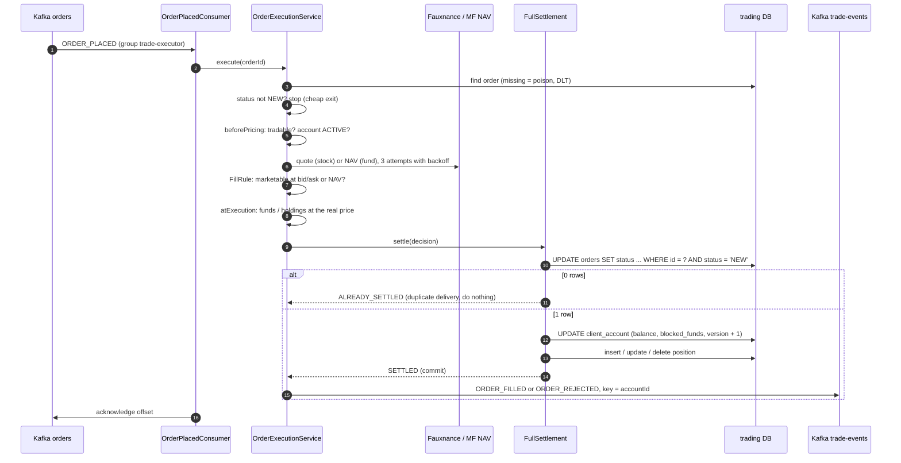
```mermaid
sequenceDiagram
    autonumber
    participant K as Kafka orders
    participant C as OrderPlacedConsumer
    participant X as OrderExecutionService
    participant Q as Fauxnance / MF NAV
    participant S as FullSettlement
    participant DB as trading DB
    participant T as Kafka trade-events

    K->>C: ORDER_PLACED (group trade-executor)
    C->>X: execute(orderId)
    X->>DB: find order (missing = poison, DLT)
    X->>X: status not NEW? stop (cheap exit)
    X->>X: beforePricing: tradable? account ACTIVE?
    X->>Q: quote (stock) or NAV (fund), 3 attempts with backoff
    X->>X: FillRule: marketable at bid/ask or NAV?
    X->>X: atExecution: funds / holdings at the real price
    X->>S: settle(decision)
    S->>DB: UPDATE orders SET status ... WHERE id = ? AND status = 'NEW'
    alt 0 rows
        S-->>X: ALREADY_SETTLED (duplicate delivery, do nothing)
    else 1 row
        S->>DB: UPDATE client_account (balance, blocked_funds, version + 1)
        S->>DB: insert / update / delete position
        S-->>X: SETTLED (commit)
        X->>T: ORDER_FILLED or ORDER_REJECTED, key = accountId
    end
    C->>K: acknowledge offset
```

Order states:

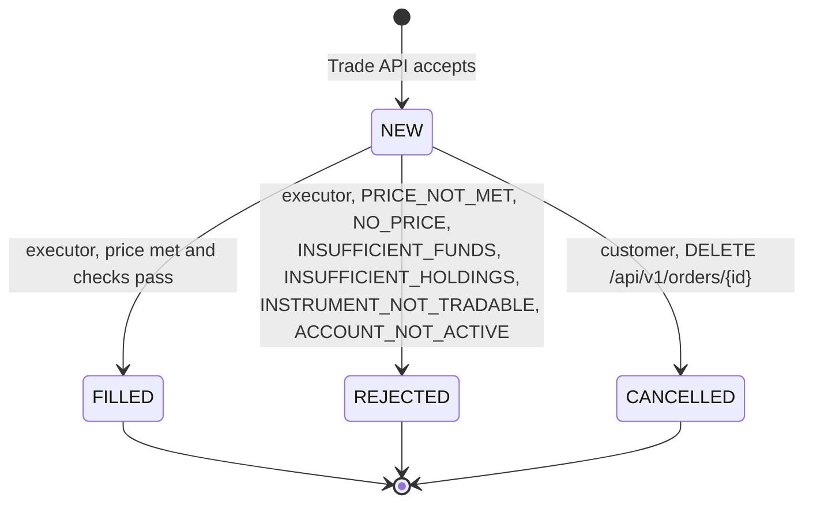
```mermaid
stateDiagram-v2
    [*] --> NEW : Trade API accepts
    NEW --> FILLED : executor, price met and checks pass
    NEW --> REJECTED : executor, PRICE_NOT_MET, NO_PRICE,<br/>INSUFFICIENT_FUNDS, INSUFFICIENT_HOLDINGS,<br/>INSTRUMENT_NOT_TRADABLE, ACCOUNT_NOT_ACTIVE
    NEW --> CANCELLED : customer, DELETE /api/v1/orders/{id}
    FILLED --> [*]
    REJECTED --> [*]
    CANCELLED --> [*]
```

Each arrow out of `NEW` is a guarded update. The executor and the cancel route can race. The database lets only one win:

```sql
-- services/trade-api/src/main/resources/mapper/OrderMapper.xml:125
UPDATE orders
   SET status = 'CANCELLED', resolved_at = #{resolvedAt}
 WHERE order_id = #{orderId}
   AND status   = 'NEW'
```

The schema also enforces the shape of a resolved order (`002_api_alignment.sql`, `004_execution_columns.sql`):

```sql
CHECK ((status =  'NEW' AND resolved_at IS NULL)
    OR (status <> 'NEW' AND resolved_at IS NOT NULL));
CHECK (status <> 'FILLED' OR fill_price IS NOT NULL);
CHECK (rejection_reason IS NULL OR status IN ('REJECTED', 'CANCELLED'));
```

### 4.5 How cash moves

`available = balance - blocked_funds`. The database enforces `blocked_funds <= balance` and both are `>= 0`.

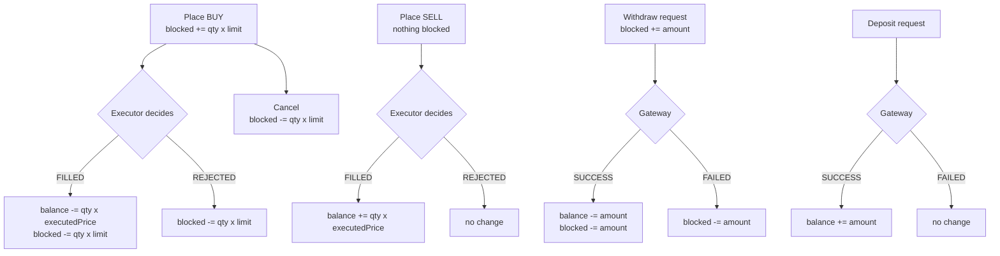
```mermaid
flowchart TD
    A["Place BUY<br/>blocked += qty x limit"] --> B{Executor decides}
    B -- FILLED --> C["balance -= qty x executedPrice<br/>blocked -= qty x limit"]
    B -- REJECTED --> D["blocked -= qty x limit"]
    A --> E["Cancel<br/>blocked -= qty x limit"]
    F["Place SELL<br/>nothing blocked"] --> G{Executor decides}
    G -- FILLED --> H["balance += qty x executedPrice"]
    G -- REJECTED --> I["no change"]
    J["Withdraw request<br/>blocked += amount"] --> K{Gateway}
    K -- SUCCESS --> L["balance -= amount<br/>blocked -= amount"]
    K -- FAILED --> M["blocked -= amount"]
    N["Deposit request"] --> O{Gateway}
    O -- SUCCESS --> P["balance += amount"]
    O -- FAILED --> Q["no change"]
```

The executor settles cash under the optimistic lock and retries 5 times (`services/trade-executor/src/main/java/com/yellow/executor/settle/FullSettlement.java:109`):

```java
for (int attempt = 1; attempt <= MAX_LOCK_ATTEMPTS; attempt++) {
    int rows = mapper.updateAccount(order.accountId(), balanceDelta, blockedDelta, account.getVersion());
    if (rows == 1) return;
    if (attempt < MAX_LOCK_ATTEMPTS) account = mapper.findAccount(order.accountId());
}
throw new LockExhaustedException(...);  // transient: Kafka retries the message
```

### 4.6 Cancel an order (Sprint 10 change)

Before Sprint 10, only the executor published to `trade-events`. A cancel reached no consumer. Now the cancel writes an outbox row in the same transaction.

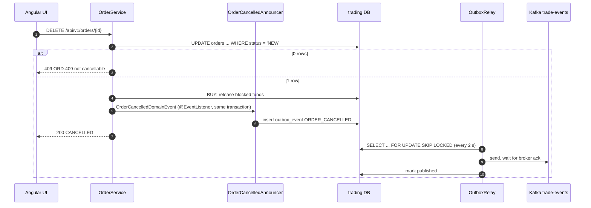
```mermaid
sequenceDiagram
    autonumber
    participant UI as Angular UI
    participant OS as OrderService
    participant A as OrderCancelledAnnouncer
    participant DB as trading DB
    participant R as OutboxRelay
    participant T as Kafka trade-events

    UI->>OS: DELETE /api/v1/orders/{id}
    OS->>DB: UPDATE orders ... WHERE status = 'NEW'
    alt 0 rows
        OS-->>UI: 409 ORD-409 not cancellable
    else 1 row
        OS->>DB: BUY: release blocked funds
        OS->>A: OrderCancelledDomainEvent (@EventListener, same transaction)
        A->>DB: insert outbox_event ORDER_CANCELLED
        OS-->>UI: 200 CANCELLED
        R->>DB: SELECT ... FOR UPDATE SKIP LOCKED (every 2 s)
        R->>T: send, wait for broker ack
        R->>DB: mark published
    end
```

### 4.7 Deposits and withdrawals

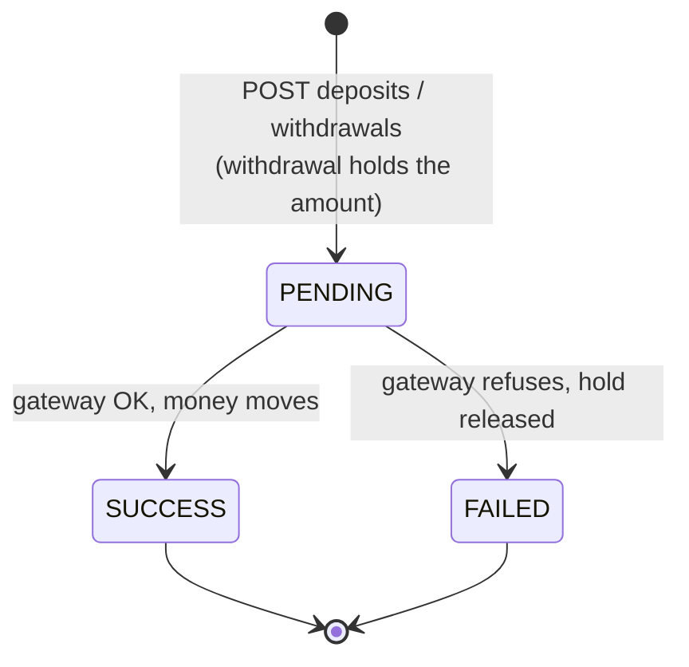
```mermaid
stateDiagram-v2
    [*] --> PENDING : POST deposits / withdrawals<br/>(withdrawal holds the amount)
    PENDING --> SUCCESS : gateway OK, money moves
    PENDING --> FAILED : gateway refuses, hold released
    SUCCESS --> [*]
    FAILED --> [*]
```

Idempotency for money (`services/trade-api/src/main/java/com/yellow/trade/payments/PaymentService.java`): the same key with the same amount and direction returns the first transfer. The same key with a different transfer is refused (`PAY-409`). So a retry after a lost response never moves money two times.

### 4.8 Market data: the poller

Fauxnance has no push feed. The executor makes one: `MarketDataPoller`.

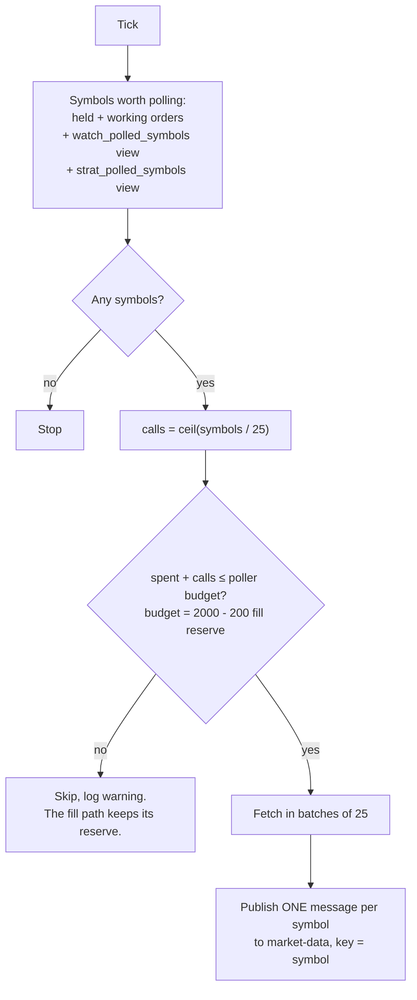
```mermaid
flowchart TD
    T["Tick"] --> S["Symbols worth polling:<br/>held + working orders<br/>+ watch_polled_symbols view<br/>+ strat_polled_symbols view"]
    S --> E{Any symbols?}
    E -- no --> Z[Stop]
    E -- yes --> C["calls = ceil(symbols / 25)"]
    C --> Q{"spent + calls ≤ poller budget?<br/>budget = 2000 - 200 fill reserve"}
    Q -- no --> W["Skip, log warning.<br/>The fill path keeps its reserve."]
    Q -- yes --> B["Fetch in batches of 25"]
    B --> P["Publish ONE message per symbol<br/>to market-data, key = symbol"]
```

Why one message per symbol: batching the HTTP call saves quota. Batching the Kafka message would break per-symbol keys and ordering.

---

## 5. Kafka in depth

### 5.1 Topics

| Topic | Key | Partitions | Retention | Producer | Event types |
|---|---|---|---|---|---|
| `orders` | accountId | 3 | 7 days | Trade API | `ORDER_PLACED` |
| `trade-events` | accountId | 3 | 30 days | Executor; Trade API (cancel, via outbox) | `ORDER_FILLED`, `ORDER_REJECTED`, `ORDER_CANCELLED` |
| `market-data` | symbol | 6 | 1 day | Executor's poller (`source: market-poller`) | `QUOTE` |
| `kyc-events` | clientId | 3 | 7 days | Trade API KYC (via outbox) | `KYC_VERIFIED` |
| `account-provisioning` | clientId | 3 | 7 days | Auth (via outbox) | `ACCOUNT_PROVISIONED` |
| `<topic>.DLT` | same | 1 | same as parent | error handlers | the failed message, reason in headers |

Auto-create is **off** on the broker. `scripts/create-topics.sh` makes all topics and DLTs. Why off: auto-create silently makes a one-partition topic with default retention, which is wrong for every topic here. An error is better than a silent wrong platform.

### 5.2 Topology: who produces, who consumes

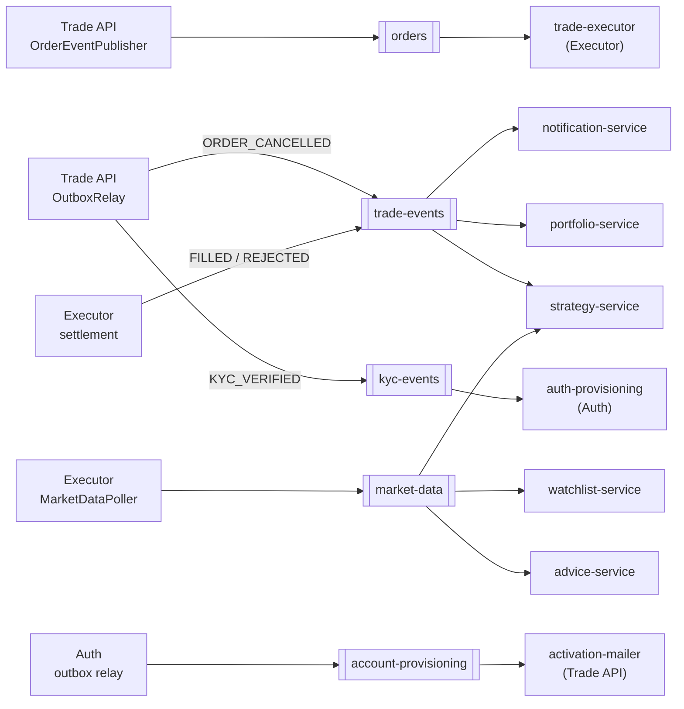
```mermaid
flowchart LR
    API_P["Trade API<br/>OrderEventPublisher"]
    API_O["Trade API<br/>OutboxRelay"]
    EXE["Executor<br/>settlement"]
    POLL["Executor<br/>MarketDataPoller"]
    AUTH_O["Auth<br/>outbox relay"]

    O[["orders"]]
    TE[["trade-events"]]
    MD[["market-data"]]
    KY[["kyc-events"]]
    AP[["account-provisioning"]]

    API_P --> O
    API_O -- ORDER_CANCELLED --> TE
    API_O -- KYC_VERIFIED --> KY
    EXE -- "FILLED / REJECTED" --> TE
    POLL --> MD
    AUTH_O --> AP

    O --> G1["trade-executor<br/>(Executor)"]
    TE --> G2["notification-service"]
    TE --> G3["portfolio-service"]
    TE --> G4["strategy-service"]
    MD --> G5["watchlist-service"]
    MD --> G6["advice-service"]
    MD --> G4
    KY --> G7["auth-provisioning<br/>(Auth)"]
    AP --> G8["activation-mailer<br/>(Trade API)"]
```

Two rules from the matrix:

- `orders` has **exactly one consumer group**. It is a work queue. A second group would execute each order two times.
- The **Angular UI never talks to Kafka**. Browsers do not hold Kafka credentials.

### 5.3 Why the key decides everything

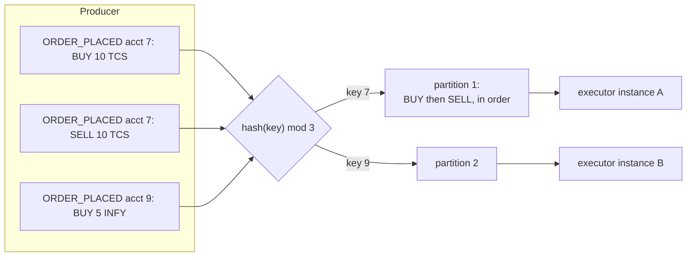
```mermaid
flowchart LR
    subgraph Producer
        M1["ORDER_PLACED acct 7: BUY 10 TCS"]
        M2["ORDER_PLACED acct 7: SELL 10 TCS"]
        M3["ORDER_PLACED acct 9: BUY 5 INFY"]
    end
    H{"hash(key) mod 3"}
    M1 --> H
    M2 --> H
    M3 --> H
    H -- "key 7" --> P1["partition 1:<br/>BUY then SELL, in order"]
    H -- "key 9" --> P2["partition 2"]
    P1 --> E1["executor instance A"]
    P2 --> E2["executor instance B"]
```

- Kafka orders messages **inside one partition only**.
- Key `accountId`: a sell that depends on the buy that funded it always comes after the buy.
- Key `symbol` for quotes: a consumer never sees an older TCS quote after a newer one.
- **Never key by orderId**: each message goes to a random partition and per-account order is lost.
- 3 partitions on `orders`: up to 3 executor instances in one group. More instances than partitions sit idle.
- Partitions can grow but never shrink. Growth rehashes keys, so an account's history splits. Our guarded update still protects money, but ordering must be checked again after a resize.

### 5.4 The envelope (same on every topic)

| Field | Type | Meaning |
|---|---|---|
| `eventId` | UUID | Unique per message. The idempotency key for consumers. |
| `eventType` | enum string | Picks the payload shape. |
| `eventTime` | RFC 3339 UTC | When the producer made the event. |
| `source` | string | Producing component: `trade-api`, `trade-executor`, `market-poller`, `kyc-service`, `auth-service`. |
| `schemaVersion` | int, starts at 1 | Increase only on a breaking change. |
| `payload` | object | Topic- and type-specific. |

Schema evolution rules: adding an optional field is not breaking. Removing, renaming or changing a type is breaking. Consumers ignore fields they do not know.

`eventTime` is not `quoteAsOf`. `eventTime` is when the poller published. `quoteAsOf` is when the price was observed. Fauxnance quotes are delayed, so a strategy that uses `eventTime` acts on an older price than it thinks.

`trade-events` carries `cashDelta`, `positionQuantityAfter` and `averageCostAfter`. Why: a consumer can keep its own projection of the portfolio without a query to Postgres.

### 5.5 Delivery semantics: at-least-once

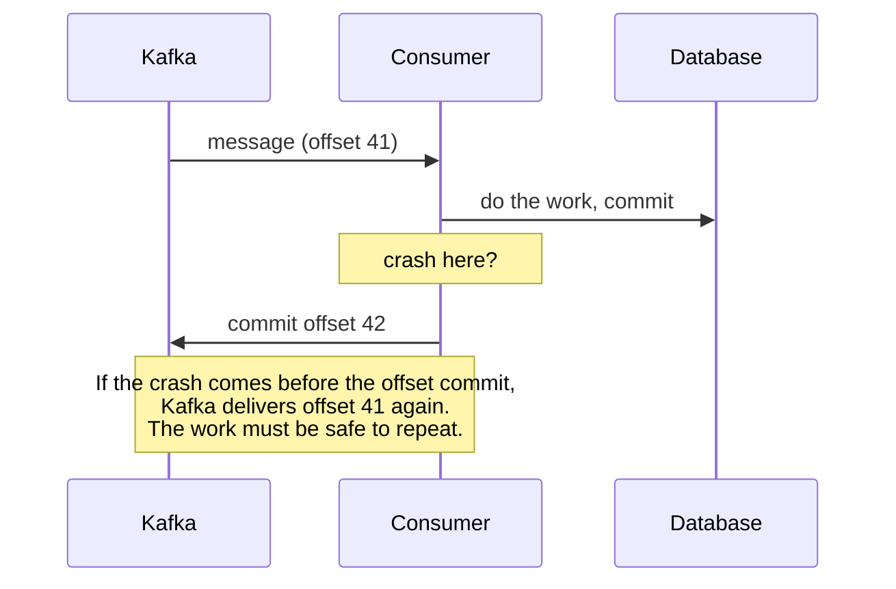
```mermaid
sequenceDiagram
    participant K as Kafka
    participant C as Consumer
    participant DB as Database
    K->>C: message (offset 41)
    C->>DB: do the work, commit
    Note over C: crash here?
    C->>K: commit offset 42
    Note over K,C: If the crash comes before the offset commit,<br/>Kafka delivers offset 41 again.<br/>The work must be safe to repeat.
```

| Side | Setting | Why |
|---|---|---|
| Producer | `acks=all`, `enable.idempotence=true`, high `retries`, `max.in.flight <= 5` | No loss on broker failover; no duplicates from producer retries. |
| Consumer | `enable.auto.commit=false`, `AckMode.RECORD` | Commit after the work. A crash repeats work; it never loses it. |
| Consumer | idempotent handler | A repeat does nothing the second time. |

How each consumer is idempotent:

| Consumer | Group | Idempotency mechanism | New group starts at |
|---|---|---|---|
| Executor | `trade-executor` | `UPDATE orders ... WHERE status = 'NEW'` | - |
| Notifications | `notification-service` | `UNIQUE NULLS NOT DISTINCT (event_id, alert_id)` | **latest** (do not mail a month of old trades) |
| Portfolio | `portfolio-service` | `pf_realised.event_id` PK + `order_id` UNIQUE | **earliest** (book old sales; nothing is sent) |
| Watchlists | `watchlist-service` | alert must be `ACTIVE`; `quote_as_of` guard | - |
| Strategy | `strategy-service` | `UNIQUE (strategy_id, source_event_id)` + order idempotency key | **latest** (an old quote must never spend money now) |
| Advice | `advice-service` | in-memory latest price; recompute is safe | latest |
| Auth provisioning | `auth-provisioning` | `INSERT ... ON CONFLICT DO NOTHING` | earliest |
| Activation mailer | `activation-mailer` | `activation_email.event_id` PK | earliest |

Why not Kafka exactly-once transactions: they give exactly-once between topics. Our side effects are database writes, not topic writes. The guarded update gives the same result with less machinery.

### 5.6 Errors: retry or dead-letter

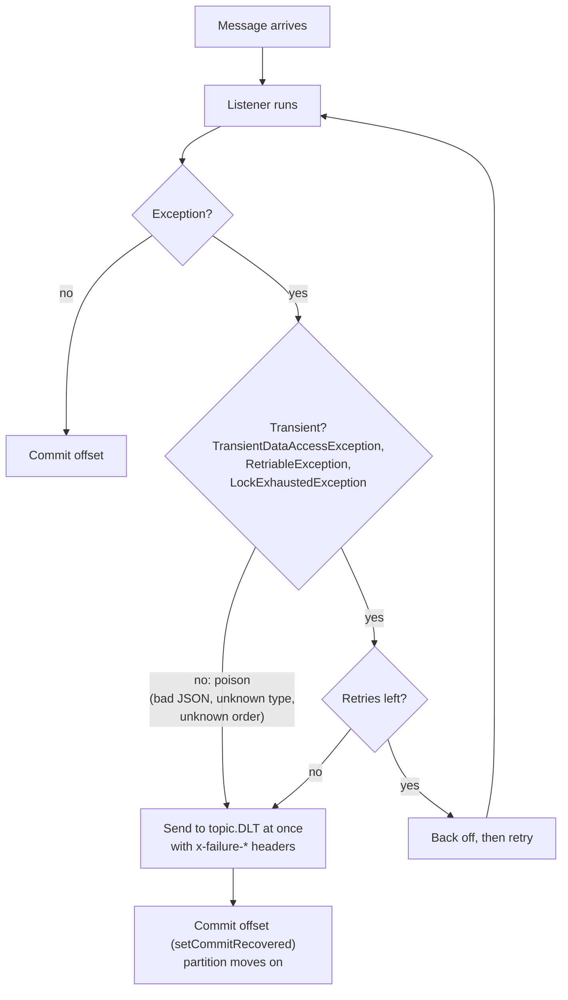
```mermaid
flowchart TD
    M["Message arrives"] --> L["Listener runs"]
    L --> OK{Exception?}
    OK -- no --> ACK["Commit offset"]
    OK -- yes --> CL{"Transient?<br/>TransientDataAccessException,<br/>RetriableException,<br/>LockExhaustedException"}
    CL -- "no: poison<br/>(bad JSON, unknown type,<br/>unknown order)" --> DLT["Send to topic.DLT at once<br/>with x-failure-* headers"]
    CL -- yes --> RT{"Retries left?"}
    RT -- yes --> BO["Back off, then retry"] --> L
    RT -- no --> DLT
    DLT --> ACK2["Commit offset (setCommitRecovered)<br/>partition moves on"]
```

Executor back-off: 500 ms, x4, max 10 s, 3 retries (4 attempts in total). Modules: fixed 1 s, 3 retries. Headers on a DLT record: `x-failure-reason`, `x-failure-class` (POISON / TRANSIENT), `x-original-topic`, `x-original-partition`, `x-original-offset`, `x-attempt-count`, `x-failed-at`.

Why `handler.defaultFalse()` (`services/trade-executor/src/main/java/com/yellow/executor/consume/ConsumerErrorHandling.java`): an unknown exception is poison by default. A poison message retried forever blocks its partition, and so every account on that partition.

A real fix in this branch (commit `644ebe8`): the DLT producer used only a byte serializer. It could not send an object the listener had already parsed. The recoverer failed, Kafka re-delivered, and **one refused order stopped the partition forever**. Now there are two DLT templates: raw bytes and JSON.

```java
// ConsumerErrorHandling.java
Map<Class<?>, KafkaOperations<?, ?>> templates = new LinkedHashMap<>();
templates.put(byte[].class, dltKafkaTemplate);      // never parsed
templates.put(Object.class, dltJsonKafkaTemplate);  // parsed, then refused
```

### 5.7 The transactional outbox

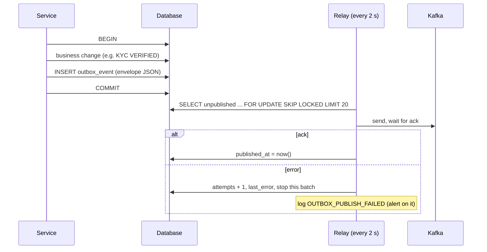
```mermaid
sequenceDiagram
    participant S as Service
    participant DB as Database
    participant R as Relay (every 2 s)
    participant K as Kafka
    S->>DB: BEGIN
    S->>DB: business change (e.g. KYC VERIFIED)
    S->>DB: INSERT outbox_event (envelope JSON)
    S->>DB: COMMIT
    R->>DB: SELECT unpublished ... FOR UPDATE SKIP LOCKED LIMIT 20
    R->>K: send, wait for ack
    alt ack
        R->>DB: published_at = now()
    else error
        R->>DB: attempts + 1, last_error, stop this batch
        Note over R: log OUTBOX_PUBLISH_FAILED (alert on it)
    end
```

- A rolled-back change leaves no outbox row, so no false event.
- A committed change always has a row. The relay retries without limit.
- `SKIP LOCKED`: a second instance takes a different batch, not the same one.
- A crash after send and before "published" sends again. Consumers are idempotent on `eventId`, so this is safe.

Where we use it: KYC (`outbox_event` in `trading`), auth provisioning (`outbox_event` in `auth`), and order cancel. Where we **do not** use it yet: `ORDER_PLACED` and the executor's `trade-events`. See [edge cases U1 and U2](#112-not-solved-or-partly-solved-and-how-to-solve-them).

---

## 6. Database

### 6.1 Who owns what

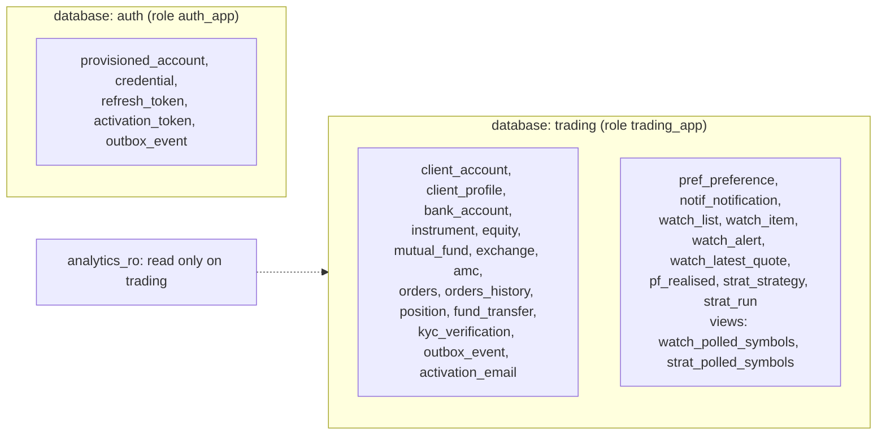
```mermaid
flowchart LR
    subgraph trading["database: trading (role trading_app)"]
        core["client_account, client_profile, bank_account,<br/>instrument, equity, mutual_fund, exchange, amc,<br/>orders, orders_history, position, fund_transfer,<br/>kyc_verification, outbox_event, activation_email"]
        s10["pref_preference, notif_notification,<br/>watch_list, watch_item, watch_alert, watch_latest_quote,<br/>pf_realised, strat_strategy, strat_run<br/>views: watch_polled_symbols, strat_polled_symbols"]
    end
    subgraph auth["database: auth (role auth_app)"]
        a["provisioned_account, credential,<br/>refresh_token, activation_token, outbox_event"]
    end
    ro["analytics_ro: read only on trading"]
    ro -.-> trading
```

No foreign key crosses the two databases. `provisioned_account.account_id` equals `client_account.client_id` by agreement, carried by Kafka events.

### 6.2 Core trading schema


```mermaid
erDiagram
    client_account ||--|| client_profile : "has (1:1)"
    client_account ||--o| bank_account : "has one"
    client_account ||--o| kyc_verification : "has one"
    client_account ||--o{ orders : places
    client_account ||--o{ position : holds
    client_account ||--o{ fund_transfer : moves
    client_account ||--o{ activation_email : "is emailed"
    instrument ||--o| equity : "subtype"
    instrument ||--o| mutual_fund : "subtype"
    exchange ||--o{ equity : lists
    amc ||--o{ mutual_fund : manages
    instrument ||--o{ orders : "is traded in"
    instrument ||--o{ position : "is held in"

    client_account {
        int client_id PK
        varchar account_ref UK "ACC-000001"
        varchar pan UK
        varchar demat_id UK
        varchar kyc_status "PENDING VERIFIED REJECTED"
        varchar status "ACTIVE SUSPENDED CLOSED"
        numeric balance "gte 0"
        numeric blocked_funds "gte 0 and lte balance"
        int version "optimistic lock"
        timestamptz updated_at "set by trigger"
    }
    client_profile {
        int client_id PK, FK
        varchar name
        date dob
        varchar email UK
        varchar phone_number
    }
    bank_account {
        int client_id PK, FK
        varchar account_number "9 to 18 digits"
        char ifsc "AAAA0XXXXXX"
        varchar holder_name
    }
    instrument {
        int instrument_id PK
        varchar instrument_type "STOCK ETF MF"
        varchar isin UK
        boolean is_tradable
    }
    equity {
        int instrument_id PK, FK
        varchar ticker
        varchar exchange_code FK
    }
    mutual_fund {
        int instrument_id PK, FK
        varchar scheme_code UK
        int amc_id FK
        varchar plan_type
    }
    orders {
        uuid order_id PK
        int client_id FK
        int instrument_id FK
        varchar side "BUY SELL"
        numeric quantity "18,6"
        numeric price "limit"
        varchar status "NEW FILLED REJECTED CANCELLED"
        numeric fill_price
        varchar rejection_reason
        varchar idempotency_key "UK with client_id"
        timestamptz date_placed
        timestamptz resolved_at
    }
    position {
        bigint position_id PK
        int client_id FK
        int instrument_id FK
        varchar position_type "DELIVERY INTRADAY"
        numeric quantity "gt 0"
        numeric average_price
    }
    fund_transfer {
        bigint transfer_id PK
        int client_id FK
        numeric amount "gt 0"
        varchar direction "DEPOSIT WITHDRAWAL"
        varchar status "PENDING SUCCESS FAILED"
        varchar idempotency_key "UK with client_id"
    }
    kyc_verification {
        int client_id PK, FK
        varchar status
        text reason
        jsonb checks
        int attempts
    }
```

Design points to know:

- **Supertype / subtype with a composite FK.** `instrument` has `UNIQUE (instrument_id, instrument_type)`. `equity` and `mutual_fund` reference that pair. So a row cannot be both an equity and a fund. The database enforces disjoint subtypes.
- **`position` has no FK to `orders`.** A holding outlives the archived order that made it.
- **A closed position is deleted, not set to zero.** `CHECK (quantity > 0)` says a row is a real holding.
- **`orders_history` stays column-identical to `orders`.** The archive job copies by position. History holds only terminal states.
- **`account_ref` is not the primary key.** A support call cannot guess the next account by adding one.
- **`updated_at` is set by a trigger** (`003_account_last_updated.sql`), so no future writer can forget it.
- **Quantities are `NUMERIC(18,6)`.** A fund holds fractional units.

### 6.3 Sprint 10 tables

```mermaid
erDiagram
    client_account ||--o| pref_preference : "settings"
    client_account ||--o{ notif_notification : "is owed"
    client_account ||--o{ watch_list : names
    watch_list ||--o{ watch_item : contains
    instrument ||--o{ watch_item : "is watched"
    client_account ||--o{ watch_alert : sets
    instrument ||--o{ watch_alert : "has alerts"
    instrument ||--o| watch_latest_quote : "last price"
    client_account ||--o{ pf_realised : "books P and L"
    client_account ||--o{ strat_strategy : owns
    strat_strategy ||--o{ strat_run : "records firings"

    pref_preference {
        int client_id PK, FK
        int default_account_id "CHECK equals client_id"
        varchar landing_screen "dashboard orders holdings market-watch"
        varchar alert_channel "EMAIL IN_APP"
    }
    notif_notification {
        uuid notification_id PK
        uuid event_id "UK with alert_id, NULLS NOT DISTINCT"
        bigint alert_id "only for PRICE_ALERT"
        int client_id FK
        varchar kind
        varchar status "QUEUED SENT FAILED"
        varchar channel "set at send"
        varchar destination "masked"
        int attempts
        timestamptz next_attempt_at
        timestamptz read_at
    }
    watch_alert {
        bigint alert_id PK
        int client_id FK
        int instrument_id FK
        varchar direction "ABOVE BELOW"
        numeric threshold "gt 0"
        varchar status "ACTIVE TRIGGERED CANCELLED"
        uuid notification_id "key, not FK"
    }
    watch_latest_quote {
        int instrument_id PK, FK
        numeric price
        boolean stale
        timestamptz quote_as_of
    }
    pf_realised {
        uuid event_id PK
        uuid order_id UK
        int client_id FK
        numeric quantity
        numeric sale_price
        numeric average_cost
        numeric realised "CHECK equals formula"
        timestamptz booked_at
    }
    strat_strategy {
        bigint strategy_id PK
        int client_id FK
        int instrument_id FK
        varchar side
        int quantity
        varchar trigger_kind "FALLS_THROUGH RISES_THROUGH"
        numeric trigger_price
        numeric max_spend
        int max_position
        boolean enabled
        varchar status "ARMED FIRED STOPPED"
        int failures "0 to 3"
    }
    strat_run {
        bigint run_id PK
        bigint strategy_id FK
        varchar outcome
        uuid order_id
        uuid source_event_id "UK with strategy_id"
    }
```

`watch_alert.notification_id` is a key, not a foreign key. Why: that table belongs to another module. A foreign key would couple the two modules' migrations.

The database checks the P&L formula itself (`014_portfolio.sql`):

```sql
CONSTRAINT ck_pf_realised_sum
    CHECK (realised = round((sale_price - average_cost) * quantity, 4))
```

### 6.4 Auth database

```mermaid
erDiagram
    provisioned_account ||--o| credential : "is claimed by"
    credential ||--o{ refresh_token : has
    provisioned_account ||--o{ activation_token : "is sent"

    provisioned_account {
        bigint account_id PK "equals client_id"
        uuid claimed_by
        timestamptz claimed_at
    }
    credential {
        uuid id PK "JWT sub"
        varchar username UK
        text password_hash "argon2id"
        bigint account_id UK, FK
        text_array roles "default CUSTOMER"
    }
    refresh_token {
        char token_hash PK "SHA-256"
        uuid credential_id FK
        timestamptz expires_at
        timestamptz exchanged_at "reuse alarm"
    }
    activation_token {
        char token_hash PK "SHA-256"
        bigint client_id FK
        timestamptz expires_at "24 h"
        timestamptz used_at
        timestamptz revoked_at
    }
```

Why store only hashes: read access to this database does not give session takeover. A hash cannot be presented to the service.

### 6.5 Who writes each table, and when

| Table | Writer | When | How it changes |
|---|---|---|---|
| `client_account` | Onboarding | apply | insert ACTIVE, KYC PENDING |
| `client_account.kyc_status` | KycDecider | job | guarded `WHERE kyc_status = 'PENDING'` |
| `client_account.blocked_funds` | Trade API | place BUY, cancel, withdraw | `WHERE version = ?`, `version + 1` |
| `client_account.balance` | Executor; PaymentDecider | fill; transfer decided | `WHERE version = ?` (executor) |
| `orders` | Trade API (insert, cancel); Executor (settle) | place; cancel; execute | guarded `WHERE status = 'NEW'` |
| `position` | Executor | fill | insert, update (weighted average), delete at zero |
| `fund_transfer` | PaymentService; PaymentJob | request; decide | `PENDING -> SUCCESS / FAILED` |
| `kyc_verification` | Onboarding; KycVerificationJob | apply; job | `PENDING -> VERIFIED / REJECTED` |
| `outbox_event` | KycDecider, OrderCancelledAnnouncer; OutboxRelay | in business transaction; relay | insert; `published_at` |
| `activation_email` | ActivationService | after email sent | insert `event_id` |
| `pref_preference` | PreferenceService | `PUT .../preferences` | upsert |
| `notif_notification` | NotificationLedger; NotificationDispatcher; read route | consume; dispatch; mark read | `QUEUED -> SENT / FAILED`, `read_at` |
| `watch_*` | Watchlist / Alert services; QuoteEvaluator | routes; each quote | alert `ACTIVE -> TRIGGERED`; latest quote upsert |
| `pf_realised` | RealisedBook | each SELL `ORDER_FILLED` | insert once |
| `strat_strategy`, `strat_run` | StrategyService; StrategyFirer; StrategyOutcomes | routes; quote; trade event | `ARMED -> FIRED / STOPPED`; run outcomes |
| auth tables | Auth service | register, login, refresh, provision | see section 7 |

### 6.6 Indexes worth naming

Partial indexes keep hot queries small. They index only the rows the query reads.

| Index | Serves |
|---|---|
| `ix_orders_unresolved ON orders (date_placed) WHERE status = 'NEW'` | find unresolved orders (replay path) |
| `ix_kyc_verification_pending ... WHERE status = 'PENDING'` | KYC job |
| `ix_fund_transfer_pending ... WHERE status = 'PENDING'` | payment job |
| `ix_outbox_event_unpublished ... WHERE published_at IS NULL` | outbox relay |
| `ix_notif_queued ON (next_attempt_at) WHERE status = 'QUEUED'` | dispatcher |
| `ix_watch_alert_active ON (instrument_id, direction, threshold) WHERE status = 'ACTIVE'` | every quote |
| `ix_strat_armed ... WHERE enabled AND status = 'ARMED'` | every quote |
| `uq_orders_client_idempotency_key (client_id, idempotency_key)` | duplicate order guard |

More: `docs/data/index-justification.md`.

### 6.7 How migrations run

- Postgres runs files in `/docker-entrypoint-initdb.d/` in name order, **only when the volume is empty** (`docker-compose.yml`).
- Order: roles, base schema, migrations 001 to 015, indexes, seeds, then the auth schema (applied to the `auth` database by `13-auth-schema.sh`).
- Each migration is idempotent (`IF NOT EXISTS`, `DO $$ ... $$` checks). A re-run is a no-op.
- Each Sprint 10 module has its own migration (011 to 015), in merge order.
- To apply a new migration to an existing volume: `data/db/local/reset.sql` or a fresh volume.

---

## 7. Auth scheme

### 7.1 The access token (JWT)

HS256, 15 minutes, signed by auth, verified by the Trade API with the same `JWT_SECRET` (`services/auth/src/tokens/claims.ts`).

| Claim | Value | Why |
|---|---|---|
| `sub` | credential UUID | Not the username: a username can change. |
| `accountId` | number | The only claim the Trade API uses for access control. |
| `roles` | `["CUSTOMER"]`, plus `"STRATEGY"` on a strategy token | Tells a log which orders a strategy placed. |
| `iat`, `exp` | seconds | `exp = iat + 900`. |
| `iss` | `auth-service` | Consumers check the issuer. |

Six claims and no more. The payload is base64, not encrypted. Every claim is public to the holder, and every claim is one a consumer can start to depend on.

### 7.2 How the Trade API checks a token

```mermaid
flowchart TD
    R["Request to /api/v1/*"] --> CORS["CorsConfig filter<br/>(answers preflight first)"]
    CORS --> H{"Authorization: Bearer ...?"}
    H -- no --> X401["401 AUTH-401 Unauthorised"]
    H -- yes --> K["1. Signature, HMAC key ≥ 32 bytes"]
    K --> E["2. Expiry"]
    E --> I["3. Issuer = auth-service"]
    I --> A["4. alg in VERIFIED header = HS256"]
    A --> C{"5. accountId claim is a number?"}
    C -- no --> X401
    C -- yes --> SET["Put accountId on the request"]
    SET --> CTRL["Controller"]
    CTRL --> OWN{"path account = token account?"}
    OWN -- no --> X403["403 ACC-403, logged"]
    OWN -- yes --> OK["Do the work"]
    K -- fail --> X401
    E -- fail --> X401
    I -- fail --> X401
    A -- fail --> X401
```

`services/trade-api/src/main/java/com/yellow/trade/security/JwtTokenVerifier.java:40`:

```java
JwtParser parser = Jwts.parser()
        .verifyWith(key)               // signature, MAC only
        .requireIssuer(expectedIssuer)
        .build();
verified = parser.parseSignedClaims(compactToken);   // also checks exp
// the algorithm, read off the VERIFIED header, not the raw string
if (!expectedAlgorithm.equals(verified.getHeader().getAlgorithm())) { ... }
Object accountId = claims.get("accountId");          // only now read a claim
```

Every failure gives the same body: `{"errorCode":"AUTH-401","message":"Unauthorised"}`. The server log has the real reason. The client gets nothing it can use to probe.

The ownership check (`security/AccountAccess.java:31`). A different account gives 403 **before** the code checks if the account exists. So a caller who probes account numbers learns nothing:

```java
public void requireOwn(long accountId) {
    if (!caller.canReach(accountId)) {
        log.warn("ACC-403: token for account {} addressed account {}", caller.accountId(), accountId);
        throw new AccountNotReachableException();
    }
    if (accounts.findById(accountId) == null) throw new AccountNotFoundException(accountId);
}
```

### 7.3 Refresh tokens: rotation with reuse detection

```mermaid
stateDiagram-v2
    [*] --> Live : issued at login or refresh (7 days)
    Live --> Exchanged : presented once, new pair issued
    Live --> Expired : 7 days pass
    Exchanged --> AllRevoked : presented AGAIN<br/≥ theft alarm<br/>SECURITY_REFRESH_REPLAY
    AllRevoked --> [*] : user must sign in again
    Expired --> [*]
```

`services/auth/src/tokens/refresh-token.service.ts:32`:

```ts
if (stored.exchangedAt) {
  // Either a client repeated a request or a token was stolen. We cannot tell which.
  const revoked = await this.store.revokeAllFor(stored.credentialId);
  this.log.warn(`${REFRESH_REPLAY_EVENT} credential=${stored.credentialId} revoked=${revoked}`);
  throw PlatformError.unauthorised();
}
if (!(await this.store.markExchanged(hash))) {   // lost a race with a concurrent refresh
  throw PlatformError.unauthorised();
}
```

Why revoke the presented token, not only reissue: with reissue alone, the thief and the user both keep live sessions and nothing shows that there are two.

The UI side matches this: `SessionRefresh` keeps **one exchange in flight** (`frontend/src/app/core/session/session-refresh.ts`). Two parallel refreshes would present the token two times, and auth would treat that as theft.

### 7.4 Passwords and login throttle

- **argon2id**, 64 MiB, t=4, p=1 (`services/auth/src/credentials/password-hasher.ts:19`). The cost was measured on the target hardware: about 135 ms. `p=1` lets parallel logins use separate cores.
- **Uniform failure.** Unknown user and wrong password give the same 401. The unknown-user path verifies a dummy hash, so the time is the same (measured ratio 1.05).
- **Throttle:** 5 failures per caller IP per 60 s, then `429 AUTH-429`. The counter is in Redis Cloud, so it is shared by all auth instances.

The Redis counter is one atomic Lua script. A crash between `INCR` and `PEXPIRE` would leave a key with no expiry: a permanent lock-out (`services/auth/src/auth/redis-attempt-store.ts`):

```lua
local count = redis.call('INCR', KEYS[1])
if count == 1 then
  redis.call('PEXPIRE', KEYS[1], ARGV[1])
end
return count
```

If Redis is down, `FallbackAttemptStore` counts in memory, logs one warning per outage, and logs recovery. Logins keep working.

### 7.5 Service-to-service: the internal secret

Two internal routes on auth: `POST /internal/activation-tokens` and `POST /internal/strategy-tokens`. Both use `InternalSecretGuard` (`services/auth/src/activation/internal-secret.guard.ts`):

```ts
const candidate = digest(typeof presented === 'string' ? presented : '');
if (typeof presented !== 'string' || !timingSafeEqual(candidate, this.expected)) {
  throw PlatformError.unauthorised();
}
```

Both sides are SHA-256 hashed first. So `timingSafeEqual` always compares equal lengths, and the time tells nothing about the secret.

### 7.6 Strategy token (decision 0012)

A strategy fires when nobody is signed in. It must still place its order through `POST /api/v1/orders`, so all the order checks apply. Auth mints a **5-minute** token for the account with role `STRATEGY` added. The order route needs no change.

### 7.7 Browser side

- Tokens are in `sessionStorage`. A reload keeps the session. Closing the tab ends it.
- `authInterceptor` adds the Bearer header only for an **allow list** of origin + path: the Trade API `/api/v1/` and auth `/auth/me` (`frontend/src/app/core/http/auth.interceptor.ts:44`). A deny list fails open the day someone adds a new host.
- `authGuard` is on the parent route. Every new child route is guarded by default.
- The UI reads claims (for `accountId` and `exp`) but never trusts them. The APIs verify.
- CORS: exact origins from `CORS_ALLOWED_ORIGINS`. Methods include `PUT` since Sprint 10 (preferences).

---

## 8. DTOs, API and errors

### 8.1 Routes

| Area | Route | Auth |
|---|---|---|
| Onboarding | `POST /onboarding/applications` | public, 5 per hour per IP |
| Orders | `POST /api/v1/orders`, `DELETE /api/v1/orders/{id}` | Bearer |
| Accounts | `GET /api/v1/accounts/{id}`, `/balance`, `/positions`, `/orders` | Bearer + own account |
| Market | `GET /api/v1/instruments`, `/quotes`, `/instruments/{symbol}/candles` | Bearer |
| Payments | `GET .../bank-account`, `GET .../transfers`, `POST .../deposits`, `POST .../withdrawals` | Bearer + own account |
| Preferences | `GET`, `PUT /api/v1/accounts/{id}/preferences` | Bearer + own account |
| Notifications | `GET .../notifications`, `GET .../notifications/unread`, `POST .../notifications/{nid}/read` | Bearer + own account |
| Watchlists | `.../watchlists`, `.../watchlists/{wid}`, `.../watchlists/{wid}/items/{symbol}`, `.../alerts`, `.../alerts/{aid}`, `.../alerts/{aid}/rearm` | Bearer + own account |
| Portfolio | `GET /api/v1/portfolio/{accountId}`, `/positions`, `/pnl`; `GET /health` (public, status only) | Bearer + own account |
| Advice | `GET /api/v1/advice/{symbol}` | Bearer (public market data) |
| Strategy | `.../strategies`, `.../strategies/{sid}`, `.../strategies/{sid}/enabled`, `.../strategies/{sid}/runs` | Bearer + own account |
| Auth | `POST /auth/register`, `/auth/login`, `/auth/refresh`; `GET /auth/me` | public; `/me` Bearer |
| Internal | `POST /internal/activation-tokens`, `/internal/strategy-tokens` | `x-internal-secret` |

`POST /api/v1/orders` answers **200, not 201**, as the contract says.

### 8.2 Request DTO validation

`libs/domain/src/main/java/com/yellow/dto/PlaceOrderRequest.java`:

```java
@NotNull @Min(1)                                   private Long accountId;
@NotBlank @Size(min = 1, max = 20)                 private String symbol;
@NotNull                                           private OrderSide side;
@NotNull @Min(1)                                   private Integer quantity;
@NotNull @DecimalMin("0.01") @Digits(integer = 10, fraction = 2) private BigDecimal price;
@NotBlank @Size(min = 8, max = 100)                private String idempotencyKey;
```

Two layers: bean validation on the shape (`422 VAL-422`), then the domain rules on the meaning (section 4.3).

Auth DTOs use `class-validator` with `forbidNonWhitelisted`: `RegisterRequest` is `{ username, password, activationToken }`. Sending `accountId` or `roles` is refused with `VAL-422`. This closes the "self-declared ADMIN" risk.

### 8.3 Response DTOs

| DTO | Fields | Notes |
|---|---|---|
| `OrderResponse` | orderId, status, message, symbol, side, quantity, price | `message` is display only. Never branch on it. |
| `AccountResponse` | accountId (string ref), status, lastUpdated, ... | `accountId` here is `ACC-000001`, not the numeric key. |
| `PositionResponse` | symbol, quantity (decimal), averagePrice, ... | quantity is decimal: a deviation recorded in `contracts/DEVIATIONS.md` |
| `PortfolioSummary` | cash, marketValue, costBasis, unrealisedPnl(+%), realisedPnl, totalValue, partial | `partial` true when some holding has no price |
| `TokenResponse` | accessToken, refreshToken, tokenType, expiresIn | |
| Advice `Signal` | direction, strength, reason, figures (sma20, sma50, rsi14), methodology, disclaimer | Always carries the disclaimer |

### 8.4 One error envelope

Every error from every service is `{ "errorCode": "XXX-NNN", "message": "..." }` and nothing else. No stack trace. An unknown exception is `500 SRV-500 "Something went wrong"`.

| Code | HTTP | Meaning |
|---|---|---|
| `AUTH-401` | 401 | any token or login failure (one message for all causes) |
| `AUTH-409` | 409 | username taken |
| `AUTH-429` | 429 | login throttle |
| `ACC-403` | 403 | not your account, or account not active / KYC not verified |
| `ACC-404` | 404 | your own account does not exist |
| `INS-404` | 404 | unknown or not tradable instrument |
| `ORD-400` | 400 | insufficient funds |
| `ORD-409` | 409 / 404 | duplicate order, insufficient holdings, not cancellable, lost optimistic lock, order not found (contract has no ORD-404) |
| `VAL-422` | 422 | input failed validation |
| `PAY-400 / 404 / 409` | | payment refused, no bank account, key reused |
| `RATE-429` | 429 | onboarding rate limit |
| `MKT-503` | 503 | nothing could be priced |
| `LIM-409` | 409 | per-account cap reached (watchlists, alerts, strategies) |
| `NTF-404`, `WCH-404`, `STR-404` | 404 | no such record on this account |
| `REQ-404 / 405 / 415` | | unknown route, method, media type |
| `SRV-500` | 500 | anything else |

### 8.5 Contract-first and the generated client

```mermaid
flowchart LR
    Y["contracts/*.yaml<br/>services/trade-api/openapi/*.yaml"] --> G["openapi generator"]
    G --> TS["frontend/src/generated/*<br/>typed Angular clients"]
    Y --> CT["OpenApiExtensionContractTest<br/>fails build on drift"]
    TS --> W["frontend/src/app/core/api/*<br/>thin wrappers"]
    TS --> CHK["scripts/check-generated.mjs<br/>generated code is up to date"]
```

---

## 9. Sprint 10 extensions

### 9.1 Preferences

- One row per customer, written the first time they save Settings: default account, landing screen, alert channel.
- No row = documented defaults: own account, dashboard, EMAIL (decision 0004).
- The email address is **not copied** here. It is read from `client_profile` at send time (decision 0003). One copy of personal data, and no customer-supplied destination (no SSRF-like risk).
- "Default account" has only one possible value (one login = one account), so we paired it with a landing screen to make the preference visible at next sign-in (decision 0005, proposed).

The seam, `ProfileChannelResolver.resolve` (`preferences/ProfileChannelResolver.java:32`):

```java
AlertChannel channel = row == null ? PreferenceService.DEFAULT_CHANNEL
                                   : AlertChannel.valueOf(row.getAlertChannel());
if (channel == AlertChannel.IN_APP) return new ResolvedChannel(IN_APP, null, row == null);
String address = profiles.findEmail(accountId);
if (address == null || address.isBlank()) {
    return new ResolvedChannel(IN_APP, null, row == null);  // inbox rather than nowhere
}
return new ResolvedChannel(EMAIL, address, row == null);
```

### 9.2 Notifications

```mermaid
flowchart LR
    TE[["trade-events"]] --> L["TradeEventsListener<br/>group notification-service"]
    W["watchlists<br/>QuoteEvaluator"] -- "AlertDelivery.deliver<br/>(caller's transaction)" --> LED
    L --> LED["NotificationLedger<br/>INSERT QUEUED<br/>unique (event_id, alert_id)"]
    LED --> DB[("notif_notification")]
    J["NotificationDispatchJob<br/>own thread, every 2 s"] --> D["NotificationDispatcher<br/>lockDue FOR UPDATE SKIP LOCKED"]
    DB --> D
    D -- "resolve at send time" --> PR["preferences<br/>ChannelResolver"]
    D -- EMAIL --> SMTP["Gmail"]
    D -- IN_APP --> IN["inbox + bell"]
```

```mermaid
stateDiagram-v2
    [*] --> QUEUED : ledger records (before offset commit)
    QUEUED --> SENT : email accepted, or IN_APP
    QUEUED --> QUEUED : mail refused, attempts + 1,<br/>wait 30 s x attempts
    QUEUED --> QUEUED : preferences did not answer<br/>(never send on a guess)
    QUEUED --> FAILED : 5th refusal, or account gone
    SENT --> [*]
    FAILED --> [*]
```

Why a ledger (decision 0006): a slow mail server must not stall a Kafka partition. A crash must not lose a message. The offset commits once the row is QUEUED, not once Gmail confirms.

Why `UNIQUE NULLS NOT DISTINCT (event_id, alert_id)`: one quote can cross many customers' alerts. A key on `event_id` alone would keep the first and drop the rest as "duplicates". With `NULLS NOT DISTINCT`, a trade event (no alert) is still unique on `event_id`.

Why its own thread: a slow mail server must never delay a KYC decision or a deposit on the shared `@Scheduled` pool.

### 9.3 Watchlists and price alerts

```mermaid
sequenceDiagram
    autonumber
    participant K as market-data
    participant Q as QuoteEvaluator (one transaction)
    participant DB as trading DB
    participant N as NotificationLedger
    K->>Q: QUOTE TCS 3,950 (group watchlist-service)
    Q->>DB: upsert watch_latest_quote WHERE old.quote_as_of ≤ new.quote_as_of
    alt older quote
        Q-->>K: nothing changes
    else newer
        Q->>DB: SELECT ACTIVE alerts crossed ... FOR UPDATE SKIP LOCKED
        loop each crossed alert
            Q->>N: deliver(AlertNotice) inserts QUEUED (MANDATORY propagation)
            Q->>DB: UPDATE watch_alert SET TRIGGERED, notification_id WHERE status = 'ACTIVE'
        end
    end
```

```mermaid
stateDiagram-v2
    [*] --> ACTIVE : POST alerts (max 20 active)
    ACTIVE --> TRIGGERED : first quote at or past threshold
    TRIGGERED --> ACTIVE : POST .../rearm (customer)
    ACTIVE --> CANCELLED : DELETE
    TRIGGERED --> CANCELLED : DELETE
```

- **Fire once, then wait for re-arm** (decision 0007). Firing on every quote past the level would send "forty messages in a minute".
- **Trigger and enqueue in one transaction** (decision 0008). An alert never says "TRIGGERED" with nothing queued. `AlertDelivery.deliver` uses `Propagation.MANDATORY`, so a call outside a transaction is refused.
- **Caps** (`WatchLimits`): 5 watchlists, 50 items each, 20 active alerts. Past a cap: `LIM-409`. An unbounded alert table would make the market-data consumer the thing that takes the order service down.
- **The poller must price watched symbols** (decision 0009): the module owns the view `watch_polled_symbols`, and the executor reads it. On the live stack the poll grew from 10 to 17 symbols, still one request per cycle.

### 9.4 Portfolio and P&L

- Unrealised: computed on request from `position` and live prices (`portfolio/Valuation.java:27`).
- Realised: booked at each sale from `trade-events`, never recomputed (decision 0011).
- A forged event cannot invent P&L: `RealisedBook` books only if `orders` has that order as a **filled SELL on that account** (`portfolio/RealisedBook.java:58`).
- A position with no price is left out of the totals, not counted at zero. The summary says `partial: true`. No price at all: `503 MKT-503`.
- Stocks priced by Fauxnance, funds by MF NAV, both through the shared cached `PriceService`. INR only (decision 0010).

```mermaid
flowchart LR
    TE[["trade-events"]] --> RB["RealisedBook<br/>SELL + ORDER_FILLED only"]
    RB --> CHK{"orders row is a FILLED SELL<br/>on this account?"}
    CHK -- no --> SKIP["log, book nothing"]
    CHK -- yes --> INS["INSERT pf_realised<br/>(event_id PK, order_id UK)"]
    POS[("position")] --> V["Valuation.of"]
    PR["PriceService<br/>cache + budget"] --> V
    V --> S["summary / positions / pnl"]
    INS --> S
```

### 9.5 Trade advice (stretch)

One methodology: **20-day vs 50-day SMA, confirmed by RSI(14)**. Recomputed every 5 minutes, only for symbols someone asked about. Candles cached 6 hours. No table: signals live in memory (decision 0015).

```mermaid
flowchart TD
    A["Daily closes"] --> B{"50 or more closes?"}
    B -- no --> H1["HOLD: no 50-day average yet"]
    B -- yes --> G["gap = (SMA20 - SMA50) / SMA50 x 100"]
    G --> L{"abs(gap) under 0.25 %?"}
    L -- yes --> H2["HOLD: averages level, no trend"]
    L -- no --> U{"gap > 0?"}
    U -- yes --> OB{"RSI ≥ 70?"}
    OB -- yes --> H3["HOLD: overbought"]
    OB -- no --> BUY["BUY"]
    U -- no --> OS{"RSI ≤ 30?"}
    OS -- yes --> H4["HOLD: oversold"]
    OS -- no --> SELL["SELL"]
```

Every response carries: "Information, not advice. Computed from delayed educational data; past prices do not predict future ones." A fund has no daily candles here, so it is refused with `VAL-422`, not given a signal from other data.

### 9.6 Automated strategies (stretch)

```mermaid
sequenceDiagram
    autonumber
    participant K as market-data
    participant F as StrategyFirer (one transaction)
    participant DB as trading DB
    participant AU as Auth /internal/strategy-tokens
    participant API as POST /api/v1/orders
    participant TE as trade-events

    K->>F: QUOTE (group strategy-service)
    F->>DB: SELECT strategy WHERE enabled AND ARMED FOR UPDATE
    F->>F: crosses trigger? (FALLS_THROUGH: price ≤ level)
    F->>F: limit = ask x 1.005 (buy) or bid x 0.995 (sell)
    F->>F: BUY: limit x qty ≤ maxSpend? held + qty ≤ maxPosition?
    alt over a bound
        F->>DB: run REFUSED_LIMIT, strategy STOPPED
    else inside bounds
        F->>DB: INSERT run PLACED unique (strategy_id, quote eventId)
        F->>AU: mint 5-minute token for the account
        F->>API: place order, idempotencyKey strategy-{id}-{eventId}
        API-->>F: 200 NEW (or error: failures + 1, 3rd = STOPPED)
        F->>DB: run gets orderId, strategy FIRED
    end
    TE->>F: ORDER_FILLED / REJECTED for that order: run outcome updated
```

```mermaid
stateDiagram-v2
    [*] --> ARMED : create (enabled = false)
    ARMED --> FIRED : order placed
    ARMED --> STOPPED : bound refused, or 3 failures
    FIRED --> ARMED : customer re-enables
    STOPPED --> ARMED : customer re-enables
```

Why go through the public order route: its token check, validation and idempotency stand between a strategy bug and a real position. Why a 5-minute token: it is used at once for one order; a longer life only widens a leak.

Why the row lock: a "disable" that arrives during a firing waits, then takes effect for the next quote. Never half-way. The order route's transaction touches no strategy table, so the two cannot deadlock.

---

## 10. Algorithms and techniques, and why we chose them

### 10.1 Weighted average cost

`newAvg = (oldQty x oldAvg + addQty x price) / (oldQty + addQty)`, 4 decimals, HALF_UP. A sale does **not** change the average. (`libs/domain/src/main/java/com/yellow/entities/Position.java:59`)

```java
BigDecimal oldCost   = quantity.multiply(averagePrice);
BigDecimal addedCost = added.multiply(price);
this.averagePrice = oldCost.add(addedCost).divide(newQuantity, AVERAGE_PRICE_SCALE, RoundingMode.HALF_UP);
```

Why: it is the standard holding cost for Indian retail statements, and needs one row per holding. Alternative: FIFO tax lots (more correct for tax, needs a lot table; listed as "not built").

### 10.2 The fill rule (limit order against bid/ask)

`executor/fill/EquityFillRule.java:11`:

```java
BigDecimal settlementPrice = ExecutionPrice.round(order.isBuy() ? quote.buyPrice() : quote.sellPrice());
BigDecimal limit = ExecutionPrice.round(order.limitPrice());
boolean marketable = order.isBuy()
        ? limit.compareTo(settlementPrice) >= 0   // buyer pays up to the limit; ask must not exceed it
        : limit.compareTo(settlementPrice) <= 0;  // seller accepts down to the limit; bid must not fall below
```

- Buy at the **ask**, sell at the **bid**: the price a real trade settles at.
- A fund deals at its **NAV**, one price both ways (`MutualFundFillRule`).
- **Round before compare.** The quote has more decimals than `NUMERIC(18,4)`. If we compared first and rounded later, the accepted price and the charged price could differ.
- `BigDecimal` everywhere, never `double`, for money.

### 10.3 Realised and unrealised P&L

- Realised = `(salePrice - averageCostAtSale) x quantitySold`, booked once.
- Unrealised = `quantity x lastPrice - quantity x averageCost`; percent = unrealised / cost x 100 (null if cost is 0).
- Totals sum unrounded values, then round to 2 decimals.

### 10.4 SMA and Wilder's RSI

`advice/Methodology.java:78`:

```java
for (int i = 1; i <= RSI_DAYS; i++) { ... gain += max(change,0); loss += max(-change,0); }
gain /= RSI_DAYS; loss /= RSI_DAYS;                    // first averages: plain mean
for (int i = RSI_DAYS + 1; i < closes.size(); i++) {   // later days: Wilder smoothing
    gain = (gain * (RSI_DAYS - 1) + max(change, 0)) / RSI_DAYS;
    loss = (loss * (RSI_DAYS - 1) + max(-change, 0)) / RSI_DAYS;
}
if (loss == 0) return gain > 0 ? 100.0 : 50.0;
return 100 - 100 / (1 + gain / loss);
```

Strength (0 to 100) = `60 x min(1, |gap| / 4) + 40 x clamp((RSI - 50) / 20)`. 60 points for trend size, 40 for RSI agreement.

Why this pair: a moving-average crossover is the most common, most explainable trend rule. RSI stops a "buy" at an overbought peak. One rule we can defend beats three nobody can explain. A combined score looks like a recommendation, which is a legal problem.

### 10.5 Poll interval from a quota (ceiling division)

`executor/poller/PollSchedule.java:55`:

```java
long callsPerDay = SECONDS_PER_DAY * callsPerCycle(symbolCount);   // callsPerCycle = ceil(n / 25)
return ceilDiv(callsPerDay, budget);                               // fastest safe interval
// effective = max(configured, floor 60 s, required)
```

Example: 60 symbols, batch 25 → 3 calls/cycle. Budget 2000 - 200 reserve = 1800. `86,400 x 3 / 1800 = 144 s`. So the interval rises from 60 s to 144 s, and the log says why.

Why a reserve: the fill path must always price an order a customer waits for. The poller yields first.

### 10.6 Back-off strategies

| Where | Strategy | Values | Why |
|---|---|---|---|
| Fauxnance quote client | exponential, honour `Retry-After` | `initial x 2^(attempt-1)`, capped; 3 attempts | 429 tells us when to come back; obey it |
| Executor Kafka errors | exponential | 500 ms x4, max 10 s, 3 retries | DB blips clear in seconds |
| Module Kafka errors | fixed | 1 s, 3 retries | simple; the DB is local |
| Notification sends | linear | 30 s x attempt, FAILED after 5 | mail outages are minutes long; the row waits, not the partition |
| Auth Kafka consumer | reconnect | 10 s | auth must start without Kafka |
| UI session refresh | fixed | 30 s while token lives | network blips |

### 10.7 Concurrency control

| Technique | Where | Why |
|---|---|---|
| **Optimistic lock** (`version`) | `client_account` | No long row lock. Conflict is rare. Lost lock → `ORD-409` at the API, retry x5 in the executor. |
| **Guarded state transition** | `orders`, `kyc_verification`, `fund_transfer`, `watch_alert` | `UPDATE ... WHERE status = 'X'`. The database serialises it. 0 rows = someone else did it. |
| **`FOR UPDATE SKIP LOCKED`** | outbox relays, notification dispatcher, alert evaluation | A table as a work queue. Many workers, no double work, no waiting. |
| **`FOR UPDATE`** (blocking) | strategy firing; activation token claim | Here we **want** the second caller to wait. |
| **Unique keys as idempotency** | orders, transfers, notifications, realised, runs, activation emails | The second insert hits the key and does nothing. |

### 10.8 Rate limiting: fixed window

- Login: Redis, fixed 60 s window from the first failure, never extended (Lua above).
- Onboarding: in memory, 5 per hour per IP, `ConcurrentHashMap.compute` (atomic per key), sweep at 10,000 keys (`onboarding/ApplicationRateLimiter.java:40`).

Why fixed window: simple, one key, one counter. Alternative: sliding window or token bucket (smoother, needs more state).

### 10.9 Hashing and secrets

| Thing | Algorithm | Why |
|---|---|---|
| Password | argon2id (memory-hard, slow) | Fast is the one property a password hash must not have |
| Refresh / activation token | SHA-256 | Already 256 bits of random entropy, so a fast hash is correct |
| Internal secret compare | SHA-256 both sides + `timingSafeEqual` | No timing leak of length or prefix |
| JWT | HMAC-SHA256 (HS256), key >= 32 bytes, checked at start | One shared secret between two services we own |

### 10.10 Caching

| Cache | TTL | On failure |
|---|---|---|
| `PriceService` stock price | about 1 min | serve last price marked `stale` |
| `PriceService` fund NAV | about 30 min | same |
| `CandleService` daily candles | 6 h, LRU size cap | serve last candles |
| UI `LivePrices` | re-read every 15 s while tab is visible | keep last prices, show error |

A shared daily budget (`MARKET_DATA_DAILY_BUDGET`, default 400) guards the Trade API's own Fauxnance calls.

### 10.11 Analytics ETL: watermark incremental load

`pipelines/analytics/src/etl/`: extract from Postgres (`analytics_ro`), transform with pandas, load a star schema into DuckDB (`dim_date`, `dim_instrument`, `dim_account`, `fact_trades`). Facts load only rows newer than the stored watermark. Bad rows go to a dead-letter folder.

```mermaid
flowchart LR
    PG[("Postgres<br/>analytics_ro")] --> X["extract<br/>since watermark"]
    X --> T["transform +<br/>validate"]
    T -- bad rows --> DL["dead_letter/"]
    T --> L["load dims + fact_trades"]
    L --> D[("DuckDB")]
    L --> W["write new watermark"]
```

---

## 11. Edge cases

### 11.1 Solved

| # | Edge case | What we do | Where |
|---|---|---|---|
| S1 | Kafka delivers the same `ORDER_PLACED` two times | Guarded `WHERE status = 'NEW'`; second time = 0 rows, nothing moves, nothing published | `FullSettlement.java:54`; demo `scripts/duplicate-replay.sh` |
| S2 | Customer double-clicks "Buy" | Unique `(client_id, idempotency_key)` → `409 ORD-409` | migration 001, domain rule 8 |
| S3 | Two orders spend the same cash at the same time | `blocked_funds` + optimistic `version`; loser gets `ORD-409` | `OrderService.blockFunds` |
| S4 | Price moves between accept and execute | Funds and holdings re-checked at the **executed** price | `PreTradeChecks.atExecution` |
| S5 | Instrument delisted / account suspended after accept | Re-checked before pricing → `REJECTED` | `PreTradeChecks.beforePricing` |
| S6 | Fauxnance down or rate-limited | 3 attempts with back-off and `Retry-After`; then `REJECTED NO_PRICE` (a business outcome, not a stuck message) | `OrderExecutionService` |
| S7 | Cancel and fill race | Both are guarded on `NEW`; exactly one wins | `cancelIfNew`, `settleIfNew` |
| S8 | Lock conflict during settlement | 5 retries, then `LockExhaustedException` (transient) → Kafka retry | `FullSettlement` |
| S9 | Poison message | DLT on first attempt, offset committed, partition moves on | `ConsumerErrorHandling` |
| S10 | DLT publish itself fails for a parsed record | Two DLT templates (bytes and JSON) | commit `644ebe8` |
| S11 | Quotes arrive out of order | Key by symbol; `watch_latest_quote` updates only if newer `quote_as_of` | `LatestQuoteMapper` |
| S12 | Price sits above an alert level for an hour | Fire once, then re-arm | decision 0007 |
| S13 | Crash between "alert fired" and "message queued" | One transaction, `MANDATORY` propagation | decision 0008 |
| S14 | One quote crosses 100 customers' alerts | Key `(event_id, alert_id)`, not `event_id` alone | migration 012 |
| S15 | Gmail is down | Rows stay QUEUED; retry 30 s x n; FAILED after 5; partition never stalls | `NotificationDispatcher` |
| S16 | Customer never set preferences | EMAIL to profile address; no address → IN_APP | decision 0004 |
| S17 | Notifications switched on with 30 days of old events | New group starts at `latest` | decision 0006 |
| S18 | Hand-published `ORDER_FILLED` | Portfolio books only for a FILLED SELL in `orders` | `RealisedBook.java:58` |
| S19 | Sale closes a position, row deleted, no average cost | Executor sends quantity 0 and the held average cost | `OrderExecutionService` |
| S20 | Quote replayed to a strategy | Run unique on `(strategy_id, source_event_id)` + order idempotency key | migration 015 |
| S21 | Strategy bug tries to buy too much | `maxSpend`, `maxPosition`, 3-failure stop, order-route checks | `StrategyFirer` |
| S22 | Customer disables a strategy mid-firing | Row lock; disable waits and applies to the next quote | decision 0012 |
| S23 | Brute-force login across many auth instances | Redis shared counter, atomic Lua; fallback in memory | `plan.md`, `redis-attempt-store.ts` |
| S24 | Username enumeration by timing | Dummy-hash verify; same 401 body | `login-failure.ts` |
| S25 | Stolen refresh token | Rotation + reuse detection revokes all | `refresh-token.service.ts:32` |
| S26 | Two browser tabs refresh at once | One in-flight exchange | `session-refresh.ts` |
| S27 | Someone claims an account by guessing its number | Activation token from email; account from the token | sprint 8 review A01 |
| S28 | IDOR: token for account 7 reads account 8 | Path account vs token claim → 403 logged, before 404 | `AccountAccess.java:31` |
| S29 | Token sent to a third-party host | Interceptor allow list | `auth.interceptor.ts:44` |
| S30 | Kafka down when KYC passes / account provisioned | Outbox; relay retries without limit | `OutboxRelay` |
| S31 | Withdraw money that a pending BUY needs | Withdrawal holds the amount in `blocked_funds` | `PaymentService` |
| S32 | Payment retried after a lost response | Same key + same amount returns the first; different → `PAY-409` | `PaymentService.replay` |
| S33 | Scripted sign-ups / PAN enumeration | 5 per hour per IP; duplicate = same 202 | sprint 9 review A04 |
| S34 | One customer's KYC always fails and blocks the queue | `attempts` cap, then set aside | migration 008 |
| S35 | Fund units are fractional | `NUMERIC(18,6)`; decimal on responses | `DEVIATIONS.md` |
| S36 | Some holdings have no price | Left out of totals, `partial: true`; none → `MKT-503` | `Valuation` |
| S37 | Fauxnance daily quota | Poll interval stretches; 200-call fill reserve; Trade API budget + stale cache | `PollSchedule`, `PriceService` |
| S38 | A new topic is created by mistake with wrong settings | Broker auto-create is off | `docker-compose.yml` |
| S39 | Postgres init fails half way | Health check passes only after init finished | `healthcheck.sh` |

### 11.2 Not solved, or partly solved, and how to solve them

**U1. `ORDER_PLACED` can be lost.** The publish is after commit and fire-and-forget. If Kafka is down at that moment, the order stays `NEW` and its funds stay blocked. Today we only log it ("can be manually replayed"). There is a partial index `ix_orders_unresolved` for a replay, but no job uses it.

Fix A, recommended: use the outbox, as cancel already does. Insert the `ORDER_PLACED` envelope into `outbox_event` in the same transaction. `OutboxRelay` publishes it.

```java
// illustration: OrderService.placeOrder, inside the @Transactional method
outbox.insert(eventId, KafkaTopics.ORDERS, accountId.toString(), json.writeValueAsString(envelope));
// and delete OrderEventPublisher's AFTER_COMMIT send
```

Fix B: a sweeper job re-publishes `NEW` orders older than N seconds. Safe, because the executor is idempotent.

```sql
-- illustration: uses the existing partial index ix_orders_unresolved
SELECT order_id FROM orders
 WHERE status = 'NEW' AND date_placed < now() - interval '30 seconds'
 ORDER BY date_placed LIMIT 50;
```

**U2. The executor can settle an order and never announce it.** The settlement commits. Then the executor sends to `trade-events` with `kafkaTemplate.send(...)`, which is asynchronous and not awaited. If the process crashes, or the send fails, before the broker has the message, Kafka re-delivers `ORDER_PLACED`. The guarded update returns 0 rows (`ALREADY_SETTLED`), and **nothing is published**. Notifications, portfolio and strategy never hear about that fill.

Fix: an outbox table in the executor, written in the settlement transaction. The relay publishes it. Or, on `ALREADY_SETTLED`, re-publish the event from the order row (consumers are idempotent on `orderId`/`eventId`, so use a deterministic `eventId` such as `UUID.nameUUIDFromBytes("filled:" + orderId)`).

**U3. A SELL does not reserve its shares.** Two SELL orders for the same 10 shares both pass rule 7 at accept time. The executor rejects the second at execution (`INSUFFICIENT_HOLDINGS`), so the data stays correct. But the customer sees "accepted" then "rejected".

Fix: add `blocked_quantity` on `position`, like `blocked_funds`, with `CHECK (blocked_quantity <= quantity)`.

**U4. An access token cannot be revoked.** It lives 15 minutes, and there is no logout route on auth. Accepted in the Sprint 8 review.

Fix: add `POST /auth/logout` that revokes the refresh tokens. For instant revocation, add a `jti` claim and a deny list in Redis with TTL = remaining token life. The Trade API checks it.

**U5. Tokens in `sessionStorage` can be read by script (XSS).** The contract returns the refresh token in the body.

Fix: return the refresh token as an `HttpOnly; Secure; SameSite=Strict` cookie on `/auth/refresh` only, and keep a strict CSP.

**U6. Kafka has no authentication.** Anyone who reaches the broker can publish `KYC_VERIFIED` (gives a login, not trading) or a fake quote (could fire an alert or a strategy; the executor still prices from its own quote). Accepted platform risk (A08).

Fix: TLS + SASL/SCRAM, per-topic ACLs (only the Trade API writes `orders`; only the poller writes `market-data`), optional message signing.

**U7. A notification email can be sent two times.** The dispatcher sends, then marks `SENT` in the same transaction. A crash between them rolls back to `QUEUED`, and the next pass sends again. The activation email has the same at-least-once trade, by choice.

Fix: give each email a stable `Message-ID` equal to `notification_id`, or use a provider API with an idempotency key.

**U8. The dispatcher holds DB locks during SMTP.** One pass locks up to 20 rows and calls Gmail inside the transaction. A slow server keeps a long transaction open.

Fix: claim and commit first (`status = 'SENDING'`, lease until `now() + 2 min`), send outside the transaction, then mark `SENT`.

**U9. The strategy firer holds a DB connection and row lock during two HTTP calls** (token mint and order, up to 12 s). The order route needs a second pool connection. Many firings at once could exhaust the pool.

Fix: two phases. Phase 1 commits the `PLACED` run. Phase 2 calls the order route with no transaction open. Phase 3 records the result. The idempotency key already makes phase 2 safe to repeat.

**U10. Alerts and strategies fire on stale quotes.** The `stale` flag is stored but not checked before firing.

Fix: skip firing when `quote.stale()` is true, or record it on the alert and say so in the message.

**U11. In-memory state is per instance.** The onboarding rate limiter, the quota counter, the price cache and advice signals live in memory. With two instances, limits double and caches differ. After a restart, the quota count starts at 0 (`QuotaCounter.reconcile` exists but no caller uses it).

Fix: move counters to Redis (as the login throttle did). Call `reconcile` with the API's own usage count on start.

**U12. Behind a load balancer every caller has the same IP.** `trust proxy` is not set, so the login throttle and onboarding limiter share one key.

Fix: set `app.set('trust proxy', <hops>)` in auth and read `X-Forwarded-For` safely in the Trade API, only from known proxies.

**U13. Login throttle has a check-then-record race.** Parallel requests can all pass the guard before any failure is counted.

Fix: count in the guard (`INCR` first, compare after), and `DEL` on success.

**U14. One failure domain.** One Postgres instance and one Kafka broker (replication factor 1). Accepted for local development.

Fix: Postgres with a streaming replica; three Kafka brokers, replication 3, `min.insync.replicas = 2`.

**U15. Sales before the portfolio module started are not in realised P&L.** Accepted (decision 0011); the topic keeps 30 days and the group starts at `earliest`.

**U16. Roles are not used for authorisation in the Trade API.** It checks only `accountId`. The `STRATEGY` role is for audit only. There is no admin route, so this is safe today. Add role checks before adding any admin feature.

**U17. No end-of-day archive job.** `orders_history` exists, but nothing moves terminal orders there yet. `orders` grows without limit.

**U18. Partition count change.** If someone increases partitions, an account's history splits. Document and re-check the ordering assumptions before any resize.

---

## 12. Questions reviewers will probably ask

**Why Kafka and not a direct HTTP call from the Trade API to the executor?**
Execution is slow and can fail part way. Kafka decouples the two: the API stays fast, and the executor can restart without losing orders. Many consumers need the result; the producer does not need to know them.

**Why key `orders` by `accountId`?**
Kafka orders only inside a partition. The ordering we need is per account: a sell must come after the buy that funded it.

**What if the same message arrives two times?**
Every consumer is idempotent. The executor uses a guarded update. Others use unique keys. Run `scripts/duplicate-replay.sh` to show it.

**Why not exactly-once?**
Kafka exactly-once covers topic-to-topic. Our side effects are database writes. A guarded update gives the same result with less machinery.

**Why the outbox?**
Publishing inside the transaction can announce a rollback. Publishing after can lose the event. The outbox commits the event with the change, and a relay delivers it later.

**Then why does `ORDER_PLACED` not use the outbox?**
It was built in Sprint 7 with `AFTER_COMMIT`. The contract accepts it because a lost event is recoverable by replay. We know the gap (U1) and the fix: move it to the outbox.

**Why optimistic locking and not `SELECT FOR UPDATE`?**
Conflicts on one account are rare. Optimistic locking holds no lock while the request runs. On conflict we fail fast (`ORD-409`) or retry.

**Why blocked funds?**
Without a reservation, two orders could each pass the funds check and together spend more than the balance before either fills.

**Why modules and not microservices for Sprint 10?**
The binding contract says modules. One token filter already protects them. We keep the boundary with `ModuleBoundaryTest` and Java interface seams.

**Why are the seams Java interfaces?**
A route that does not exist cannot be called with a stolen customer token.

**How do you stop one customer reading another's data?**
Every route compares the path account with the token's `accountId`. Mismatch → 403, logged, before any read.

**Why HS256 and not RS256?**
Two services we own share one secret. RS256 is better when many parties verify and only one signs; it is the next step if more services verify tokens.

**What happens when a refresh token is used two times?**
We treat it as theft: revoke every refresh token of that user and log `SECURITY_REFRESH_REPLAY`.

**Why argon2id with those numbers?**
Measured on the target hardware. 64 MiB, t=4, p=1 gives about 135 ms. Slower makes login the cheapest thing to flood.

**Why fire an alert only once?**
Firing on every quote past the level floods the customer's inbox and the notifications module.

**Why does notifications start at `latest` but portfolio at `earliest`?**
Notifications sends messages: old trades must not be mailed. Portfolio sends nothing; booking old sales is correct and idempotent.

**How does a strategy place an order with nobody signed in?**
Auth mints a 5-minute token for that account on an internal route behind a secret. The strategy calls the normal order route.

**How do you avoid spending the Fauxnance quota?**
Poll only symbols someone holds, works, watches or has a strategy on. Batch 25 per request. Stretch the interval to fit the budget. Keep a 200-call reserve for fills. Cache prices in the API.

**What is your biggest known risk?**
U2: the executor can settle and not announce. The fix is an executor outbox.

---

## 13. Glossary

| Term | Meaning here |
|---|---|
| At-least-once | A message is never lost, but can arrive more than one time. |
| Idempotent | Doing it two times has the same result as one time. |
| Guarded update | `UPDATE ... WHERE status = 'X'`; 0 rows means someone else already did it. |
| Outbox | A table of events written in the business transaction, published later by a relay. |
| DLT | Dead-letter topic. Where a message goes when it cannot be processed. |
| Consumer group | A named reader. Kafka gives each group every message once, spread over its instances. |
| Offset | The position of a consumer in a partition. |
| Poison message | A message that will never succeed. Send it to the DLT at once. |
| Transient failure | A failure that can succeed later. Retry with back-off. |
| Blocked funds | Cash reserved for a pending BUY or withdrawal. |
| Limit price | The worst price the customer accepts. |
| Marketable | The limit is at or better than the current bid/ask or NAV. |
| NAV | Net asset value. The one daily price of a mutual fund. |
| Seam | The one Java interface a module lets another module use. |
| IDOR | Insecure direct object reference: reading another user's record by changing an id. |
| KRaft | Kafka mode with no ZooKeeper. |

---

## 14. Where to find things

| Topic | File |
|---|---|
| Decision log (Sprint 10) | `docs/sprints/sprint-10/decision-log/0001` to `0015` |
| Kafka contract | `contracts/kafka-topics.md`, `docs/architecture/kafka.md` |
| Security reviews | `docs/security/sprint-08-auth-review.md`, `docs/sprints/sprint-10/security-review/sprint-10-owasp.md` |
| Contract deviations | `contracts/DEVIATIONS.md` |
| Data design | `docs/data/design.md`, `docs/data/data-dictionary.md`, `docs/data/index-justification.md` |
| Schema | `data/db/base/000_base_schema.sql`, `data/db/migrations/001` to `015`, `services/auth/migrations/` |
| Order rules | `libs/domain/src/main/java/com/yellow/services/OrderService.java` |
| Execution | `services/trade-executor/src/main/java/com/yellow/executor/` |
| Token check | `services/trade-api/src/main/java/com/yellow/trade/security/` |
| Auth | `services/auth/src/` |
| Runbooks | `docs/runbooks/` (activation, event backbone, payments, Windows setup) |
| Demo scripts | `scripts/` (create topics, publish events, duplicate replay, mint demo token) |
