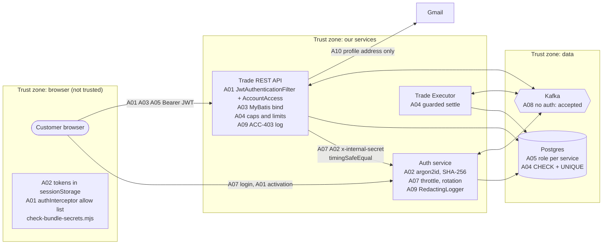
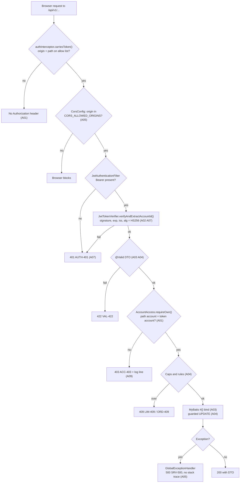
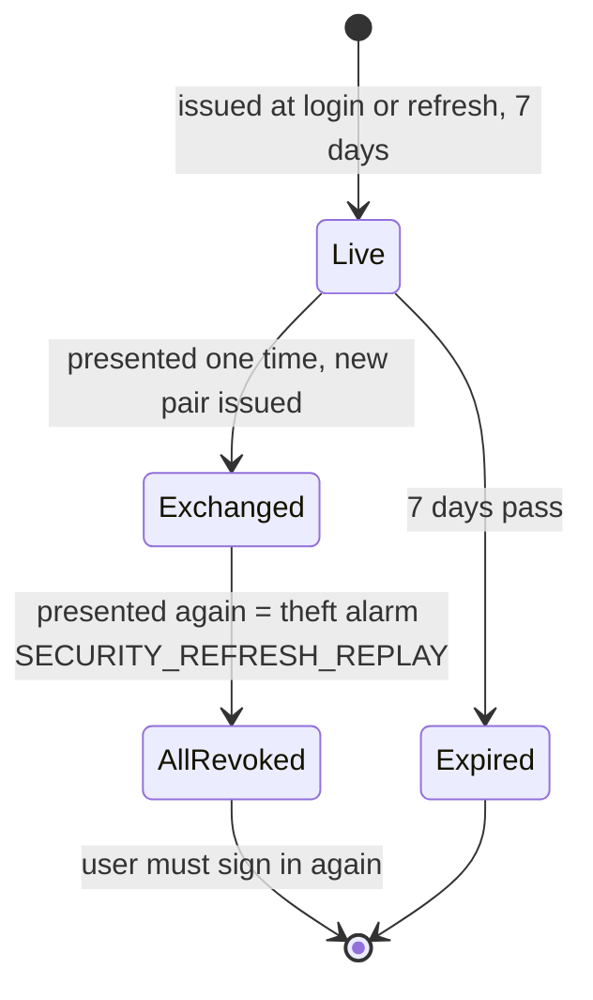
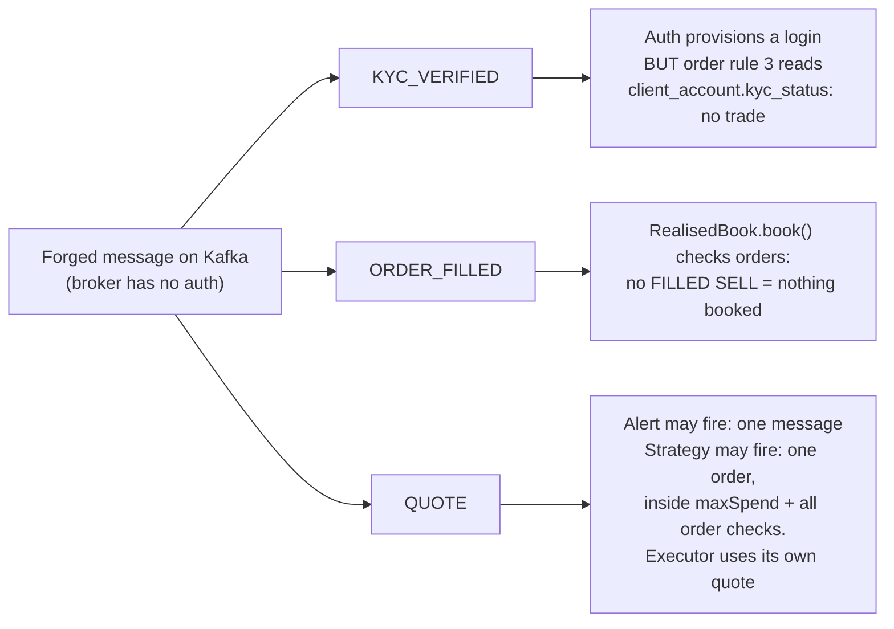

# OWASP Top Ten report: YELLOW trading platform

| Field | Value |
|---|---|
| Subject | Full platform: Angular UI, Trade REST API with the six Sprint 10 modules, Trade Executor, Auth service, PostgreSQL, Kafka |
| Standard | OWASP Top Ten 2021 (codes `A01:2021` to `A10:2021`) |
| Branch | `release/sprint10` |
| Date | 2026-10-08 |
| Language | ASD-STE100 Simplified Technical English |
| Sources | `docs/security/sprint-08-auth-review.md`, `docs/sprints/sprint-10/security-review/sprint-10-owasp.md`, the source code, and a dependency audit run on 2026-10-08 |

## 1. How to read this report

This report gives each OWASP risk, the controls that we built, the evidence, and the residual risk. It uses three status values:

| Status | Meaning |
|---|---|
| **Controlled** | A control is in the code and a test proves it. |
| **Partly controlled** | A control is in the code. A known gap remains. The gap is written here with a fix. |
| **Accepted** | We know the risk. We do not fix it in this training platform. The reason and the fix are written here. |

Each control gives `file:line` so that you can show it in the code.

## 2. Summary

| Code | Risk | Status | Main controls |
|---|---|---|---|
| `A01:2021` | Broken access control | **Controlled** | Token `accountId` compared with the path account on every route (`403 ACC-403` before any read). Activation token decides the account. Module seams are Java interfaces, not routes. |
| `A02:2021` | Cryptographic failures | **Controlled** | argon2id passwords. SHA-256 of tokens at rest. HS256 with a key of 32 bytes or more, algorithm pinned. No secret in git. |
| `A03:2021` | Injection | **Controlled** | MyBatis `#{}` binding only. `pg` `$1` placeholders. No `${}` in any mapper. DTO allow lists. |
| `A04:2021` | Insecure design | **Controlled** | Rate limits, caps (`LIM-409`), strategy bounds, fire-once alerts, idempotency keys, guarded state changes. |
| `A05:2021` | Security misconfiguration | **Partly controlled** | One database role for each service. Exact CORS origins. One error envelope with no stack trace. Gap: no HTTP security headers on the JSON APIs. |
| `A06:2021` | Vulnerable and outdated components | **Partly controlled** | Frontend: 0 production advisories. Auth: 10 production advisories (4 high), most not reachable. NestJS 11 upgrade open. |
| `A07:2021` | Identification and authentication failures | **Controlled** | Same `401` for every login failure, same time. Redis throttle. Refresh token rotation with reuse detection. 15-minute access token. |
| `A08:2021` | Software and data integrity failures | **Accepted** (mitigated) | Transactional outbox. Idempotent consumers. Portfolio checks `orders` before it books. Gap: Kafka has no authentication. |
| `A09:2021` | Security logging and monitoring failures | **Controlled** | `ACC-403` logged with both accounts. No password, token or email in logs. `SECURITY_REFRESH_REPLAY` pages on-call. |
| `A10:2021` | Server-side request forgery | **Controlled** (designed out) | No customer-supplied URL or destination. Email goes only to the profile address. |

## 3. Where the controls are



## 4. The path of one request through the controls



---

## 5. A01:2021 Broken access control

**Risk.** A customer reads or changes the data of another customer. A person claims an account that is not theirs. A module route that another module calls is open to a customer token.

### Controls

| Control | Where |
|---|---|
| The token decides the account. Each route compares the path account with the `accountId` claim. A mismatch gives `403 ACC-403` and a log line. This occurs **before** the code reads the account, so a probe learns nothing. | `services/trade-api/src/main/java/com/yellow/trade/security/AccountAccess.java:31` |
| The order route checks the account in the body against the token. | `services/trade-api/src/main/java/com/yellow/trade/services/OrderService.java:79` (`caller.canReach(accountId)`) |
| Another customer's watchlist, alert, strategy or notification id gives `404` (`WCH-404`, `STR-404`, `NTF-404`). This is the same answer as an id that does not exist. | `WatchlistService.owned()`, `AlertService.owned()`, `StrategyService.owned()`, `NotificationService.markRead()` |
| Registration needs an activation token from the email. The server gets the account from the token, never from the request. `roles` is not accepted. | `services/auth/src/auth/auth.service.ts:34`, `credentials/credential.repository.ts:60` |
| Module seams are Java interfaces (`ChannelResolver`, `AlertDelivery`, `Holdings`, `WatchedInstruments`). No route exists for them. `ModuleBoundaryTest` fails the build if a module uses another module's internals. | decision 0002 |
| The UI sends the token only to an allow list of origin and path. A deny list fails open when somebody adds a host. | `frontend/src/app/core/http/auth.interceptor.ts:17` |
| Every UI route except landing, sign-in and apply is a child of one guarded parent. A new route is guarded by default. | `frontend/src/app/app.routes.ts` (`canActivateChild: [authGuard]`) |

```java
// security/AccountAccess.java:31
public void requireOwn(long accountId) {
    if (!caller.canReach(accountId)) {
        log.warn("ACC-403: token for account {} addressed account {}", caller.accountId(), accountId);
        throw new AccountNotReachableException();
    }
    if (accounts.findById(accountId) == null) throw new AccountNotFoundException(accountId);
}
```

### Evidence

`PreferencesIntegrationTest`, `NotificationsIntegrationTest`, `WatchlistsIntegrationTest`, `PortfolioIntegrationTest`, `AdviceIntegrationTest`, `StrategyIntegrationTest`: each sends another account's token. Result: `403 ACC-403`, logged. Auth: `register.http.spec.ts` proves that `accountId` or `roles` in the body gives `422`.

### Residual risk

The Trade API does not use `roles` for access decisions. There is no admin route today, so this is safe. Add role checks before any admin feature (U16).

---

## 6. A02:2021 Cryptographic failures

**Risk.** A password, a token or a secret is stored or sent in a form that an attacker can use.

### Controls

| Data | Protection | Where |
|---|---|---|
| Password | argon2id, 64 MiB, t=4, p=1 (about 135 ms) | `services/auth/src/credentials/password-hasher.ts:21` |
| Refresh token, activation token | Only SHA-256 stored. The value has 256 bits of random data, so a fast hash is correct. | `tokens/refresh-token.repository.ts`, `activation/activation-token.service.ts:31` |
| Access token | HS256. Key must be 32 bytes or more, or the service does not start. Algorithm read from the verified header. | `trade-api/.../security/JwtTokenVerifier.java:31`, `:40` |
| Internal secret | Both sides hashed with SHA-256, then `timingSafeEqual` | `services/auth/src/activation/internal-secret.guard.ts:30` |
| Strategy token | 300 s life. Never stored, never logged (`TokenResponse.toString()` hides it). | `strategy/StrategyTokenClient.java:37` |
| Email address in a notification | Stored masked: `r***@gmail.com` | `security/Masking.java:10` |
| Secrets in git | `.env` is git-ignored (`.gitignore:12`). `.env.example` has placeholders only. | checked 2026-10-08: 0 tracked `.env` files |
| Secrets in the browser bundle | `npm run check:bundle` scans `dist/` for keys and secrets | `frontend/scripts/check-bundle-secrets.mjs` |

```ts
// services/auth/src/activation/internal-secret.guard.ts:30
const candidate = digest(typeof presented === 'string' ? presented : '');
if (typeof presented !== 'string' || !timingSafeEqual(candidate, this.expected)) {
  throw PlatformError.unauthorised();
}
```

### Residual risk

Services talk over plain HTTP inside the Docker network. A real deployment needs TLS between services.

---

## 7. A03:2021 Injection

**Risk.** Input that a customer types (a symbol, a name, a PAN) changes an SQL statement.

### Controls

- Every MyBatis statement binds values with `#{}`. The allow list of statements that may interpolate (`MAPPER_INTERPOLATION_ALLOWLIST` in `services/trade-api/manifest.env`) is empty.
- A symbol in a path goes through `InstrumentMapper.findBySymbol()` before any write. An unknown symbol stops with `404 INS-404`.
- Auth: every statement uses `$1` placeholders through `pg`. `class-validator` with `forbidNonWhitelisted` refuses unknown fields.
- Java DTOs use bean validation: `@Size`, `@Digits`, `@NotBlank`, `@Min` (example: `libs/domain/src/main/java/com/yellow/dto/PlaceOrderRequest.java`).
- The advisory lock casts the bound value: `pg_advisory_xact_lock(1015, CAST(#{clientId} AS integer))`.

```java
// watchlists/AlertMapper.java
@Select("SELECT count(*) FROM watch_alert WHERE client_id = #{clientId} AND status = 'ACTIVE'")
```

### Evidence

All mappers read for each module (Sprint 10 review evidence rows "A03"). A search for `${` in the mapper files gives no result.

---

## 8. A04:2021 Insecure design

**Risk.** The design lets a correct user, a script or a defect cause damage: spam sign-ups, unbounded tables, a strategy that spends without limit, a message sent many times.

### Controls

| Threat | Control | Where |
|---|---|---|
| Scripted sign-ups, PAN enumeration | 5 applications for each IP in one hour (`429 RATE-429`). Duplicate gives the same `202`. | `onboarding/ApplicationRateLimiter.java:40`, `OnboardingController.java:41` |
| Unbounded watchlists, alerts, strategies | 5 watchlists, 50 items, 20 active alerts, 10 strategies. Counted under `pg_advisory_xact_lock`. `409 LIM-409`. | `WatchLimits`, `StrategyService.java:23` |
| Alert flood | Fire one time, then wait for re-arm | decision 0007 |
| Strategy spends too much | `maxSpend`, `maxPosition`, stop after 3 failures, then the full order route | `StrategyFirer.java:119` |
| Double order from a double click | Idempotency key unique on `(client_id, idempotency_key)` | domain rule 8 |
| Two orders spend the same cash | `blocked_funds` plus optimistic lock on `version` | `OrderService.java:119` |
| Duplicate Kafka message | Guarded `UPDATE ... WHERE status = 'NEW'` and unique keys in every consumer | `FullSettlement.java:44` |
| Trigger without a message | Alert trigger and notification in one transaction (`MANDATORY`) | `NotificationLedger.java:57` |
| Advice read as a recommendation | One methodology, the figures shown, a disclaimer in every answer | decision 0015 |

### Residual risk

The onboarding rate limiter and the price-quota counter are in memory. With two instances, the limits double (U11). Fix: move them to Redis, as the login throttle did.

---

## 9. A05:2021 Security misconfiguration

**Risk.** A default, a wide permission, or a verbose error helps an attacker.

### Controls

- **One database role for each service.** `trading_app`, `analytics_ro`, `auth_app`. `CONNECT` is revoked from `PUBLIC`. No service connects as superuser. (`data/db/init/`)
- **Secrets have no defaults.** Auth does not start without `JWT_SECRET` or `AUTH_DATABASE_URL` (`services/auth/src/config/env.ts:26`). The Trade API does not start with a JWT key under 32 bytes.
- **CORS** allows only the exact origins in `CORS_ALLOWED_ORIGINS` and the methods `GET`, `POST`, `PUT`, `DELETE` (`security/CorsConfig.java:40`).
- **One error envelope.** `{ "errorCode", "message" }` only. An unknown exception gives `500 SRV-500 "Something went wrong"`. No stack trace (`controllers/GlobalExceptionHandler.java:184`).
- **Kafka auto-create is off.** A wrong topic name fails. It does not make a topic with wrong settings.
- **Portfolio `/health` is public** by contract. It gives status only, no customer data.
- **The activation page** sends a strict CSP: `default-src 'none'; form-action 'self'; frame-ancestors 'none'` (`services/auth/src/activation/activation-pages.ts:101`).
- **Containers** run as a non-root user: `USER auth` and `USER trade` in the three Dockerfiles.

### Open finding (new, 2026-10-08)

| ID | Finding | Severity | Fix |
|---|---|---|---|
| F-05-1 | The JSON APIs (Trade API and Auth) send no HTTP security headers: no `Strict-Transport-Security`, `X-Content-Type-Options: nosniff`, or `Content-Security-Policy`. A search for `helmet` and these header names in `services/` finds only the activation page. | Low (JSON only, no HTML served by these routes) | Auth: add `helmet()` in `main.ts`. Trade API: add Spring Security headers or a small filter that sets them. Set HSTS when TLS is on. |

---

## 10. A06:2021 Vulnerable and outdated components

**Risk.** A library with a known vulnerability runs in production.

### Evidence (run on 2026-10-08, `npm audit --omit=dev`)

| Component | Production advisories | Detail |
|---|---|---|
| `frontend` (Angular) | **0** | none |
| `services/auth` (NestJS) | **10**: 4 high, 5 moderate, 1 low, 0 critical | high: `@nestjs/platform-express`, `multer`, `js-yaml`, `lodash`. moderate: `@nestjs/common`, `@nestjs/core`, `@nestjs/config`, `@nestjs/swagger`, `qs`. low: `body-parser`. |

### Analysis

- `multer` is reachable only through a file-upload route. The auth service has no upload route (no `FileInterceptor`, no `@UploadedFile`).
- Most items need the NestJS 10 to 11 major upgrade. The Sprint 8 review did not take it on the last day of a sprint, because of the risk to working integration.
- `package-lock.json` is committed. `npm ci` installs exactly the reviewed tree.
- The Java services add no dependency in Sprint 10. The Maven tree is not yet scanned with a tool such as OWASP Dependency-Check.

### Action

| Item | Owner | Target |
|---|---|---|
| Upgrade `@nestjs/*` to 11, then run `npm audit --omit=dev` again | SA | next sprint |
| Run OWASP Dependency-Check on the Maven modules and record the result | to assign | before any real deployment |

---

## 11. A07:2021 Identification and authentication failures

**Risk.** An attacker guesses a password, finds which usernames exist, or keeps a stolen session.

### Controls

| Control | Where |
|---|---|
| Same `401 AUTH-401 "Unauthorised"` for an unknown user, a wrong password and every bad token | `services/auth/src/auth/login-failure.ts`, `JwtAuthenticationFilter.java:36` |
| Same time: the unknown-user path verifies a dummy hash. Measured ratio 1.01 to 1.05. | `login-failure.ts:13` |
| Login throttle: 5 failures for each IP in 60 s, then `429 AUTH-429`. One atomic Lua script in Redis, so all instances share it. Fallback in memory if Redis is down. | `services/auth/src/auth/redis-attempt-store.ts`, `fallback-attempt-store.ts` |
| Access token lives 15 minutes. Six claims only. | `services/auth/src/tokens/claims.ts` |
| Refresh token rotation. A token used a second time revokes every refresh token of that user and logs `SECURITY_REFRESH_REPLAY`. | `services/auth/src/tokens/refresh-token.service.ts:40` |
| The UI keeps one refresh in flight, so two tabs do not look like a theft | `frontend/src/app/core/session/session-refresh.ts` |
| A strategy acts with a 5-minute token for one account, through the same verifier | decision 0012 |



### Residual risk

- An access token cannot be revoked for its 15 minutes. There is no logout route (U4). Fix: `POST /auth/logout` and a `jti` deny list in Redis.
- Login throttle has a check-then-record race under parallel requests (U13). Fix: `INCR` first, then compare.
- Behind a load balancer every caller has one IP (U12). Fix: `trust proxy` for known proxies only.

---

## 12. A08:2021 Software and data integrity failures

**Risk.** A forged or replayed message makes the system act: provision a login, fire an alert, book P&L, place an order.

### Controls

- **Transactional outbox** for `KYC_VERIFIED`, `ACCOUNT_PROVISIONED`, `ORDER_CANCELLED`. Only a committed change is announced (`outbox/OutboxRelay.java:60`).
- **Idempotent consumers.** Each consumer has a unique key or a guarded update. A replay does nothing.
- **Portfolio checks the source.** `RealisedBook.book()` books only if `orders` holds a FILLED SELL for that account (`portfolio/RealisedBook.java:58`). A forged event books nothing.
- **KYC gate reads the database.** A forged `KYC_VERIFIED` gives a login, but the order rule reads `client_account.kyc_status`, so no trade is possible.
- **Strategy damage is bounded.** A forged quote can fire at most one order within `maxSpend` and `maxPosition`. The executor prices the fill from its own quote.
- **Dead-letter topics.** A poison message goes to `<topic>.DLT` at once, with `x-failure-*` headers.



### Residual risk (accepted)

Kafka is `PLAINTEXT` with no ACLs (U6). Fix for a real deployment: TLS and SASL/SCRAM, per-topic ACLs (only the Trade API writes `orders`, only the poller writes `market-data`).

---

## 13. A09:2021 Security logging and monitoring failures

**Risk.** An attack is not seen, or a log leaks personal data.

### Controls

- Every `ACC-403` is logged with the token account and the addressed account.
- Auth uses `RedactingLogger` only. It removes values by key name at any depth (`services/auth/src/common/redacting-logger.ts:20`).
- No password, token or email in a log. `ResolvedChannel.toString()` and `TokenResponse.toString()` leave the secret out. KYC logs the exception class only, never the message.
- `SECURITY_REFRESH_REPLAY` pages on-call at the first line (`tools/log-sink/watch-auth-alerts.mjs`).
- `OUTBOX_PUBLISH_FAILED` and `KYC_SET_ASIDE` are fixed tags for alerts.

### Evidence

`grep` of all container logs after an end-to-end run for each applicant's name, email, PAN, phone, birth date and address: 0 hits. `ActivationServiceTest.neverLogsTheTokenOrTheAddress`. Strategy test: the whole log searched for `Bearer` and `eyJ`: 0 hits.

### Residual risk

There is no central log store. The pager writes to `tools/log-sink/alerts.log` and the terminal. A webhook to a real pager is the only change needed.

---

## 14. A10:2021 Server-side request forgery

**Risk.** The server sends a request to an address that a customer supplies.

### Controls

- No module has a webhook or a URL channel.
- A notification goes only to `client_profile.email`, read at send time through `ChannelResolver` (decision 0003). The customer cannot type a destination.
- `HttpOrderPlacer` calls only its own port: `http://localhost:{server.port}/api/v1/orders` (`strategy/HttpOrderPlacer.java`).
- Auth internal URLs come from configuration (`AUTH_INTERNAL_URL`), not from a request.

**Status:** designed out.

---

## 15. Open items

| ID | Code | Item | Owner | Target |
|---|---|---|---|---|
| F-05-1 | `A05` | Add HTTP security headers to the Trade API and Auth | to assign | next sprint |
| U-06 | `A06` | NestJS 11 upgrade, then audit again | SA | next sprint |
| U-06b | `A06` | OWASP Dependency-Check on Maven modules | to assign | before a real deployment |
| U4 | `A07` | Logout and access-token revocation | to assign | before a real deployment |
| U13 | `A07` | Count in the throttle guard (no race) | to assign | next sprint |
| U6 | `A08` | Kafka TLS, SASL and ACLs | SA | before a real deployment |
| U11 | `A04` | Shared store for the onboarding limiter and quota counter | SA | next sprint |
| U16 | `A01` | Role checks before any admin route | to assign | with the first admin feature |
